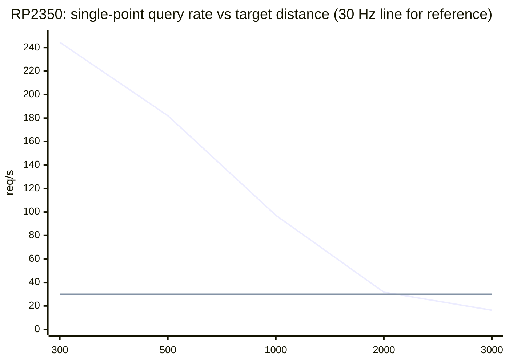
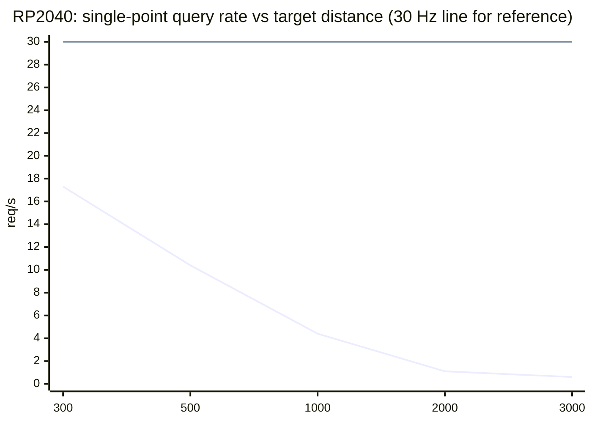

# Ballistic Co-Processor (BCP) — Implementation Backlog

Working backlog for turning `micropython-bclibc` into a standalone "ballistic
co-processor" (BCP) firmware application: a stateless-except-cached-profile
module that answers `LOAD_PROFILE` / `LOAD_CONDITIONS` / `INTEGRATE` /
`INTEGRATE_AT` / etc. requests over a framed command protocol, instead of
being used purely as a library from Python application code.

## Target platforms (phase 1)

- RP2040
- RP2350
- ESP32-S3

## Explicit non-goals (this phase)

- a7p profile parsing/loading — `LOAD_PROFILE` builds directly on the
  existing `Shot`/`Wind`/`Config` wrappers (`tiny_bclibc.py`), not an a7p
  blob. a7p integration is a later phase.
- UART and BLE (Nordic UART Service) transports — phase 1 targets USB
  CDC1 only. UART/BLE are a later transport epic reusing the same frame
  parser.
- Full BLE pairing/passkey flow — `SET_BLE_PASS` is deferred entirely
  until the BLE transport epic (no stub in v1, see Epic 8).

---

## Status at a glance (for picking this up cold)

This section is a compressed pointer into the epics below, not a
replacement for them — when a decision's *reasoning* matters, the epic's
own "Resolved"/"Superseded" bullets are the real record (why, what was
tried first, what broke, how it was verified). Read this section first,
then jump into the relevant epic for depth.

**Architecture (settled, Epic 3):** MicroPython is transport plumbing
only — it constructs/configures the CDC1 (or later UART) stream object
and hands it to C; it does not parse frames, compute CRC, or run
dispatch logic itself (a real-time target has no business converting
through Python to call C). All of that is C, living in the *one*
existing native module, `_tiny_bclibc` (+ `tiny_bclibc.py`'s thin Python
wrapper for the non-BCP engine API) — there is no separate `_bcp`/
`_bcp_frame`/`_bcp_dispatch` module. Source layout:
`src/tiny_bclibc_mp.c` (engine binding, always compiled) `#include`s
`src/bcp/bcp_frame_mp.h` (wire codec) and `src/bcp/bcp_dispatch_mp.h`
(command dispatch) under `#ifdef BCLIBC_BCP` — both are genuine `.h`
files (full function bodies, not just declarations; see
`bcp_frame_mp.h`'s own top comment for why), never compiled or
registered separately. Full byte-level wire spec: `PROTOCOL.md`.

**Implemented and hardware-verified** (unix usermod build +
`tests/test_bcp_frame_native.py`/`test_bcp_dispatch_native.py`, and
re-flashed to a real RP2040-Zero over `mpremote` at every step — not
just compiled):
- Wire framing: COBS + CRC16/CCITT-FALSE (`crc16`, `cobs_encode`/
  `cobs_decode`, `build_frame`/`parse_frame`), silent-drop + live
  `drop_count` on bad frames.
- Command dispatch: `dispatch(type, seq, payload[, emit]) ->
  (status, response_payload)` -- the optional 4th arg, `emit`, was added
  later (see the `INTEGRATE`/`INTEGRATE_FAST` entry below) for streaming
  commands only; every other command ignores it. An unrecognized `type`
  still raises `NotImplementedError` (a dev-time signal, not a wire
  status) -- every id PROTOCOL.md's command table lists now has a real
  handler, see below.
- `IDENT`, `LOAD_CONFIG`, `LOAD_PROFILE` (full `drag_type` tagged union:
  G1/G7/CUSTOM/G1_MULTIBC/G7_MULTIBC) — all call straight into the C
  engine (`tiny_bclibc_build_shot_props()`/`tiny_bclibc_find_zero_angle()`
  via the shared `bcp_resolve_zero()`), no Python involved.

**Implemented, unix-verified only (not yet hardware-verified — RP2040-Zero,
RP2350 (Pico 2) and an ESP32-S3 board are all now available as of Epic 4's
USB-transport bring-up below, but re-running `test_bcp_dispatch_native.py`'s
equivalent against real hardware for these specific commands hasn't
happened yet on any of them)**:
- `LOAD_CONDITIONS` (`src/bcp/bcp_dispatch_mp.h`'s
  `bcp_handle_load_conditions()`, PROTOCOL.md §4.3): parses atmosphere
  (`temp_c`/`pressure_hpa`/`altitude_ft`/`humidity`), shot geometry
  (`look_angle_rad`/`barrel_azimuth_rad`/`cant_angle_rad`), Coriolis
  (`latitude_deg`/`azimuth_deg`) and the `wind_count`-prefixed wind array
  (≤ `BCP_MAX_WINDS`=5) straight into `bcp_state.shot`/`bcp_state.winds`,
  then re-triggers `bcp_resolve_zero()` exactly like `LOAD_PROFILE`/
  `LOAD_CONFIG`. `ERR_BAD_ARG` on `wind_count` over the cap, `ERR_BAD_SIZE`
  on any other payload-length mismatch (§4.1's array-count rule),
  `ERR_NOT_LOADED` with no profile cached yet. Built and actually run
  against `tests/test_bcp_dispatch_native.py`'s new `LOAD_CONDITIONS`
  sections on a freshly built x64 unix usermod (`BCLIBC_BCP=1`,
  MicroPython v1.29.0) this session — all 30 checks in the file pass,
  including the ICAO-defaults/no-profile-yet case, a 5-wind (cap) and a
  6-wind (over-cap → `ERR_BAD_ARG`) case, a `wind_count`/payload-length
  mismatch (→ `ERR_BAD_SIZE`), and a cold/thin-vs-hot/dense atmosphere
  regression check (angles differ, not bit-identical — the same class of
  "defaults silently zeroed" bug `LOAD_PROFILE`'s own regression test
  above caught). Also cross-compiled and linked clean for RPI_PICO
  (RP2040, armv6m, CMake path, fresh `build-RPI_PICO/`) with
  `BCLIBC_BCP=1` this session -- FLASH 361116→364264 B (+3148 B), RAM
  24700→30220 B (+5520 B, mostly `BcpState`'s 200-point drag/5-wind
  backing arrays), no warnings.
- `INTEGRATE_AT` (`src/bcp/bcp_dispatch_mp.h`'s `bcp_handle_integrate_at()`,
  PROTOCOL.md §4/§4.5): 8 B fixed request (`key:u8, rsvd:u8[3],
  target:f32`), calls the shared `bcp_build_props()` (factored out of
  `bcp_resolve_zero()`, same call both now share) + the engine's own
  `tiny_bclibc_integrate_at()` unchanged -- no new engine code. Response
  on success is a **raw memcpy** of `TINY_BCLIBC_BaseTrajData` followed by
  `TINY_BCLIBC_TrajectoryData` (native `real_t`, not the always-f32
  encoding `LOAD_*` uses -- matches PROTOCOL.md §4.5's documented
  contract that row size depends on build precision, decoded via IDENT's
  own `real_size`/`base_traj_size`/`traj_row_size`). `ERR_BAD_ARG` if
  `key` is outside `TINY_BCLIBC_InterpKey`'s 0..7 range, `ERR_NOT_LOADED`
  with no profile cached, `ERR_INTERNAL` if the engine finds no
  bracketing crossing for `target` (`TINY_BCLIBC_ERR_INTERCEPTION`).
  Verified this session against a real G7 profile (168 gr/.308/bc=0.305,
  2750 fps, zeroed at 300 m): querying `KEY_POS_X` at the zero distance
  itself returns `distance_ft`/`px` matching the target and `height_ft`/
  `drop_angle_rad` ≈ 0 (a correctly zeroed rifle has no drop *at* its own
  zero range) -- not just "doesn't crash", the physics checks out.
  `tests/test_bcp_dispatch_native.py`'s new `INTEGRATE_AT` sections cover
  this plus the three error paths above; all 37 checks in the file pass
  on the same unix build. Also cross-compiled and linked clean for
  RPI_PICO (CMake path) -- FLASH 364264→364408 B (+144 B; small, since
  `tiny_bclibc_integrate_at()` itself already existed and was already
  compiled in for the non-BCP Python binding), RAM unchanged (no new
  persistent state), no warnings.
- `INTEGRATE`/`INTEGRATE_FAST` (`src/bcp/bcp_dispatch_mp.h`'s
  `bcp_handle_integrate()`, PROTOCOL.md §4.4/§4.4a): same 16 B `Request`
  (`range_limit_ft/range_step_ft/time_step:f32, filter_flags:i32`) for
  both, calls the shared `tiny_bclibc_integrate_stream()` unchanged --
  again no new engine code, only a wire projection of its existing row
  callback. **`dispatch()`'s call shape changed** to make streaming
  possible at all: it now takes an **optional 4th argument, `emit`** (a
  Python callable invoked once per `MORE` frame as `emit(status,
  payload)`), since a single `(status, payload)` return can't carry a
  whole trajectory -- mirrors the existing non-BCP
  `integrate_stream(shot, holder, req, cb)` binding's own callback shape.
  `dispatch()`'s return value is still the one definitive result every
  other command also returns -- here, the final `OK` frame
  (`total:u32, reason:i32`) or an error tuple; `TypeError` (not a wire
  status) if a streaming command is dispatched with no `emit`, since rows
  would otherwise silently vanish. Rows are batched
  `BCP_STREAM_ROWS_PER_FRAME`=8 to a `MORE` frame (a provisional row-count
  cap, not yet tuned against real per-transport RTT -- see Epic 5's own
  still-open ack-scheme discussion) before `emit()` fires; `INTEGRATE`'s
  rows are a raw memcpy of `TrajectoryData` per row (same native-`real_t`
  convention `INTEGRATE_AT` uses), `INTEGRATE_FAST`'s are the compact,
  always-f32 `FastTrajData` (`distance_ft, drop_angle_rad,
  windage_angle_rad, velocity_fps`) packed field-by-field, matching
  PROTOCOL.md §4.5a. `ERR_BAD_SIZE`/`ERR_NOT_LOADED` before any row is
  produced, `ERR_INTERNAL` if the engine call itself fails.
  Verified this session against the same G7 profile as `INTEGRATE_AT`
  above: a 0-1000 ft / 100 ft-step request produces exactly 11 rows,
  split across 2 `MORE` frames (8+3) whose `row_idx`/`count` bookkeeping
  sums correctly back to the reported `total`, with `reason ==
  TARGET_RANGE_REACHED`; row 0's fields are physically sane
  (`velocity_fps` == muzzle velocity, `height_ft` == `-sight_height_ft`,
  the bore-below-sight-line offset at the muzzle); `INTEGRATE_FAST`
  against the identical request reports the same `total` with its own
  compact rows decoding correctly; a short request (3 rows) exercises the
  single-frame path (no mid-stream flush, only the trailing one).
  `tests/test_bcp_dispatch_native.py`'s new sections cover all of this
  plus the no-profile/bad-size/missing-`emit` error paths -- **65 checks**
  pass in the file now, all on the same unix build described above. Also
  cross-compiled and linked clean for RPI_PICO (CMake path) -- FLASH
  364408→365008 B (+600 B), RAM unchanged (the streaming context is
  stack-allocated per call, not persistent `BcpState`), no warnings.
  **Not wired up yet**: Epic 6's cooperative-abort checkpoint (the row
  callback always returns "continue," since there's no C read/write
  loop or transport object yet to poll for a preempting frame -- Epic 4
  is still open) and `INTERRUPTED` handling; both need that transport
  work first, tracked separately.
- `RESET`/`ABORT` (`src/bcp/bcp_dispatch_mp.h`'s `bcp_handle_reset()` +
  the `BCP_CMD_ABORT` case, PROTOCOL.md §4.7/§4.8): both no-payload,
  `OK`-only commands, the simplest two in the table -- no engine call, no
  wire-format decoding. `RESET` is an **application soft-reset**: `memset`s
  the whole persistent `bcp_state` (profile, config, conditions/zero, all
  three `has_*` flags together) then re-runs
  `bcp_state_ensure_init()` on it, so "after RESET" is bit-for-bit the
  same state as a fresh boot rather than a hand-maintained list of fields
  to clear (can't drift as new `LOAD_*` fields get added later) --
  plus resets `bcp_frame_mp.h`'s `bcp_frame_drop_count_` telemetry
  counter (same translation unit, no new plumbing needed). `ABORT`
  answers `OK` unconditionally: per the no-queue preemption rule (Epic
  6), it's supposed to stop whatever's running and answer `INTERRUPTED`
  under that command's own `seq` -- but with every `dispatch()` call
  still running synchronously to completion (no C read/write loop or
  persisted in-flight state -- Epic 4 not built yet), there is nothing
  ever actually in flight for either command to preempt yet; both note
  this explicitly and point at Epic 4/6 as the prerequisite for the real
  behavior.
  Verified this session: unix usermod build -- `RESET` after a cached
  profile+config leaves `LOAD_CONFIG`/`LOAD_CONDITIONS`/`INTEGRATE_AT` all
  answering `ERR_NOT_LOADED` again (the cache is actually gone, not just
  nominally), clears `drop_count` back to `0` from a real nonzero value,
  and a fresh `LOAD_PROFILE` afterward succeeds exactly like on a cold
  boot (no stale pointer/count left over for it to trip on). `ABORT`
  verified idle (`OK`, empty payload) both before anything is loaded and
  after a `RESET`. `tests/test_bcp_dispatch_native.py`'s new `ABORT /
  RESET` section (run last, since `RESET` wipes every other section's
  cached state) covers all of this -- **74 checks** pass in the file now,
  all on the same unix build described above. Also cross-compiled and
  linked clean for RPI_PICO (CMake path) -- FLASH 365008→365064 B
  (+56 B; the smallest addition yet, consistent with "no new engine
  code, no new persistent fields, just a `memset` + one counter reset"),
  RAM unchanged, no warnings.

**Every `BCP_CMD_*` in PROTOCOL.md's command table now has a real
handler** (`LOAD_PROFILE`, `LOAD_CONFIG`, `LOAD_CONDITIONS`, `INTEGRATE`,
`INTEGRATE_FAST`, `INTEGRATE_AT`, `RESET`, `IDENT`, `ABORT`) -- an
unrecognized `type_` still raises `NotImplementedError`, a development-
time signal, not a real gap in the command table anymore.

**The read/decode/dispatch/write loop itself now exists and is
hardware-verified** -- `src/bcp/bcp_dispatch_mp.h`'s `run(stream)`
(registered as `_tiny_bclibc.run`, wrapped by `bclibc_bcp.start(stream)`):
reuses `parse_frame`/`dispatch`/`build_frame` directly (no second
implementation of any of them), accumulates transport bytes into frames
per PROTOCOL.md §1, and drives a native `emit` callback
(`bcp_run_emit`/`bcp_run_write_frame`) for `INTEGRATE`/`INTEGRATE_FAST`'s
`MORE` frames instead of the Python-callable `emit` the dispatch tests use
-- the whole loop never trips back into Python bytecode except the one
unavoidable call into a stream object's own `readinto`/`write` (same as
any other MicroPython stream consumer). A raised exception from
`dispatch()` itself (an unrecognized command, any handler failure) is
caught around just that one call and turned into an `ERR_INTERNAL`
response frame, so one bad frame from the host doesn't take down the
whole loop -- proven for real (see below), not just reasoned about.
**Verified, in order of how much of the stack each exercises:**
- Unix, no hardware: `tests/test_bcp_run_native.py` drives `run()`
  against a scripted `io.IOBase` mock stream (`MockStream`) -- single- and
  multi-chunk framing (including `EAGAIN`/`None`-return retry timing),
  a corrupt-CRC frame silently dropped with the loop continuing, an
  unrecognized command answered `ERR_INTERNAL` with the loop continuing,
  and a full `LOAD_PROFILE` + `INTEGRATE_FAST` streaming exchange (`MORE`
  frames plus the final `OK`/total summary) -- 17 checks, all pass, no
  regressions in `test_bcp_dispatch_native.py`/`test_bcp_frame_native.py`/
  `test_bclibc.py` run alongside it.
- **Real hardware, real USB, no mock**: flashed the same
  `WAVESHARE_RP2040_ZERO` build used throughout this backlog, brought up
  CDC1 exactly as Epic 4's transport bring-up already verified, then ran
  `bclibc_bcp.start(cdc1)` (blocking, foreground -- see the caveat below)
  and drove it from the host over the real `/dev/ttyACM1`-equivalent port
  with a from-scratch throwaway COBS/CRC16 host client (`bcp_frame.py`
  having been removed, see Epic 3's own "actually deleted" bullet): a
  genuine `IDENT` request round-tripped correctly end-to-end (real COBS
  encode on the host, real USB bulk transfer, real on-device `parse_frame`
  → `dispatch` → `build_frame`, real bytes back), and a corrupt-CRC frame
  followed by a good one confirmed the loop survives bad input for real --
  `drop_count` in the second `IDENT` response's own payload went from `0`
  to `1`, proving the corruption was actually counted, not just not
  crashed on.
- **Real, useful side effect found during this bring-up, not designed
  in on purpose:** running `start()`/`run()` synchronously (no second
  core/thread, Epic 7 not built yet) is not un-killable -- a `Ctrl-C`/raw-
  REPL-entry attempt on CDC0 (e.g. any `mpremote ... exec`) raised
  `KeyboardInterrupt` inside `run()`'s non-blocking-read retry path
  (`mp_hal_delay_ms(1)`, called on every "no data yet" poll, evidently
  services the same keyboard-interrupt-pending check the VM's own
  bytecode loop does) and ended the loop -- confirmed by the same
  real-hardware IDENT request getting no response at all immediately
  afterward. Useful as an escape hatch during development (the board is
  never permanently stuck); also means CDC0 REPL access and a running
  `run()` loop are mutually exclusive today, exactly as documented below,
  and a stray `Ctrl-C`/reconnect on CDC0 is enough to kill an in-progress
  BCP session -- one more reason Epic 7's second-core placement matters,
  not just for not blocking the REPL but for not being *interruptible* by
  it either.
- **Streaming over real hardware: also done, on both RP2040 and RP2350,
  with a real wire-latency benchmark, not just the unix mock-stream
  proof above.** `benchmarks/bcp_wire_bench.py` (new script) drives a
  real `INTEGRATE_FAST` (1 km/10 m steps, same G7/168gr/2750fps shot
  `benchmarks/tiny_bclibc_natmod_bench_2core.py` already uses) over a
  real CDC1 connection from the host, timing the full
  `LOAD_PROFILE` + `INTEGRATE_FAST` (14 `MORE`+`OK` frames) round trip.
  **First result was misleading, not a device problem —**
  a classic pyserial gotcha: `Serial.read(N)` blocks for the *entire*
  configured timeout if fewer than `N` bytes ever arrive, instead of
  returning as soon as *some* data is ready. The first client asked for
  `read(256)`/`read(4096)` against ~130 B/1.8 KB responses, so *every*
  measurement silently included almost the full timeout window
  (~200-550 ms) regardless of how fast the device actually answered —
  nothing to do with the wire, USB, or the dispatch loop. Fixed by only
  ever reading `ser.in_waiting or 1` bytes (see the script's own
  docstring) — this alone dropped RP2350's number from ~244 ms to
  **~43 ms** with zero device-side change, and was confirmed with a
  byte-arrival timeline (`ser.read()` with a short timeout showed all
  1.8 KB actually arriving within ~50 ms, not 200+). Also tried, on the
  device side, before finding the real cause: added
  `mp_event_handle_nowait()` (the port's own hook for pumping
  `tud_task()`, per `py/scheduler.c`/`ports/rp2/rp2_flash.c` — otherwise
  only reached via `mp_hal_delay_ms()`, which `run()`'s hot dispatch path
  never calls) after every `bcp_run_write_frame()` — harmless and kept
  (a real, if here non-load-bearing, gap: nothing was pumping the USB
  stack mid-stream before this), but it made no measurable difference on
  its own, confirming the pyserial read pattern was the whole story.
  **Real, clean numbers** (same-session local baseline via the plain
  `tiny_bclibc` Python API on the *same* flashed firmware, not
  `benches.md`'s older/different-build numbers, for a true
  wire-vs-no-wire comparison):

  | Board           | local (REPL, no wire) | CDC1 wire | overhead | ratio |
  | --------------- | --------------------: | --------: | -------: | ----: |
  | RP2040-Zero     |             313.98 ms | 355.65 ms | +41.7 ms | 1.13× |
  | RP2350 (Pico 2) |              17.90 ms |  43.42 ms | +25.5 ms | 2.43× |

  The ~25-42 ms real overhead (framing + USB + `LOAD_PROFILE`'s own
  zero-solve, folded into the same measurement) is roughly constant
  across both boards — it dominates on RP2350 only because there's so
  little solve time left to hide it behind, not because CDC1 itself is
  slower there. RP2350's local number also confirms, empirically, that
  this mainline usermod build links against hardware FPU codegen for
  RP2350 (17.90 ms lands right next to `benches.md`'s "RP2350 armv7emsp,
  hardware FPU" row, 15.99 ms — not anywhere near the "armv7m soft-float"
  row's 140.88 ms).
  **Also checked and ruled out:** CDC-ACM "baud rate" has no effect on
  USB CDC transfer speed (115200/460800/921600 all measured within noise
  of each other on RP2350) — expected, since it's a virtual serial port
  over USB full-speed bulk transfer, not a real UART with a clock to
  configure; `CDCInterface.init(baudrate=...)` only ever affects the
  reported line coding, never actual throughput (see `usb-device-cdc`'s
  own `cdc.py` docstring on this).
  **Not yet done:** the same real-hardware wire check on ESP32-S3 (only
  RP2040/RP2350 tested); placing `run()` on a second core/thread so CDC0
  stays responsive while it runs (Epic 7); and wiring Epic 6's
  cooperative-abort checkpoint / `INTERRUPTED` status into the loop for
  real (the `mp_stream_cb` hook `INTEGRATE`'s engine call takes still
  always returns "continue" -- see that command's own entry above).

**Not yet exercised, any command above**: actually running the
`LOAD_CONDITIONS`/`INTEGRATE`/`INTEGRATE_FAST`/`INTEGRATE_AT`/`RESET`/
`ABORT` dispatch handlers themselves on real hardware -- RP2040-Zero,
RP2350 (Pico 2) and an ESP32-S3 board are all now available (see Epic 4's
USB-transport bring-up), but this pass only re-verified the USB CDC1
transport coming up on each, not these dispatch commands; the firmware
built for each board froze/compiled `_tiny_bclibc`'s dispatcher but never
ran `test_bcp_dispatch_native.py`'s equivalent against it over an actual
wire connection.

**Building/testing, concretely:**
```sh
# unix usermod (fast iteration, no hardware needed)
make -C <micropython>/ports/unix VARIANT=standard BCLIBC_BCP=1 \
    USER_C_MODULES=<this repo> \
    FROZEN_MANIFEST=<this repo>/usermod/manifest.py
# then: import _tiny_bclibc as bc; bc.dispatch(bc.CMD_IDENT, 1, b"")
# run tests/test_bcp_frame_native.py / test_bcp_dispatch_native.py the
# same way tests/test_bclibc.py already documents at its own top.

# rp2 hardware
BCLIBC_BCP=1 make -C <micropython>/ports/rp2 BOARD=<board> \
    USER_C_MODULES=<this repo>/usermod/micropython.cmake \
    FROZEN_MANIFEST=<this repo>/usermod/manifest.py
```
**Gotcha, hit three times now across this epic and Epic 4:** an
*incremental* build directory can silently link/compile against a stale
generated `moduledefs`/QSTR collection after changing `BCLIBC_BCP`, after
changing *which* C symbols get registered as Python-visible names (as
opposed to just editing a function body), or after adding a **new**
QSTR-worthy name (a new Python-visible function/constant) -- seen so far
only on rp2's CMake build, not unix's Make build. Symptom varies: an
`undefined reference to <something just renamed/removed>` link error the
first two times; a `redeclaration of enumerator 'MP_QSTR_<name>'` *compile*
error the third time, adding `run()` to the globals table (a stale
`qstrdefs.generated.h` already had `MP_QSTR_run` from the frozen `asyncio`
manifest's own `run()`, and the incremental rebuild didn't regenerate it
to notice the new usermod-side reference was the same qstr, not a fresh
one). All three: `rm -rf` that one build directory before assuming it's a
real code problem -- confirmed each time that a from-scratch rebuild in a
clean directory just works.

**Another gotcha, hit during Epic 4's hardware bring-up:** the local
`micropython` checkout's `lib/pico-sdk` submodule can be checked out to a
commit that doesn't match what the checkout's own `git ls-tree` pins (a
stale/manually-fiddled submodule state, not something this repo controls)
-- symptom was `CMake Error ... Unknown CMake command
"pico_add_linker_script_override_path"` failing configure outright on a
from-scratch rp2 build, since that function didn't exist yet in the
checked-out (older) pico-sdk. Fixed with `git submodule update --init
lib/pico-sdk` inside the `micropython` checkout. Worth checking first
(`git -C <micropython> diff --stat -- lib/pico-sdk lib/tinyusb`) before
assuming a real MicroPython/pico-sdk incompatibility.

---

## Epic 1 — Build: usermod gated behind a flag

- [x] **Resolved — name: BCP (Ballistic Co-Processor), flag
      `BCLIBC_BCP`** (mirrors the existing `BCLIBC_BUILD_NATMOD` switch in
      `src/tiny_bclibc_mp.c`). Renamed from the earlier `BCLIBC_RT`: "RT"
      was meant as "runtime", but in embedded it reads as real-time (this
      backlog itself says "real-time-safe" in Epic 3), and "runtime" in
      MicroPython already means the interpreter (`py/runtime.c`). "Co-
      processor" is the established term for exactly this shape — a
      separate MCU serving a host over a framed protocol, as with
      OpenThread/Zigbee's NCP/RCP. BCE/BPE were rejected because "engine"
      already means the integrator in py-ballisticcalc
      (`RK4IntegrationEngine` etc.), BCM because it is Broadcom's chip
      prefix (Raspberry Pi SoCs).
- [x] Default: **off** — a plain usermod build for non-BCP firmware carries
      neither the C marker nor the frozen application.
- [x] **Resolved:** the application lives in `src/`, alongside
      `tiny_bclibc.py`/`tiny_bclibc_mp.c` — no new top-level directory, no
      separate repo. Its `.py` files are only **frozen** into the firmware
      image when `BCLIBC_BCP=1`. Placeholder `src/bclibc_bcp.py` for now
      (imports the C marker, nothing else).
- [x] **Implemented — one environment variable, `BCLIBC_BCP=1`, keys both
      halves.** `make BCLIBC_BCP=1 ...` or `BCLIBC_BCP=1` in the
      environment:
    - **Frozen `.py`:** `usermod/manifest.py` reads
          `os.environ["BCLIBC_BCP"]` and conditionally
          `freeze()`s `bclibc_bcp.py`. Not a `--var` as first planned:
          `makemanifest.py`'s `-v` variables are path substitutions only, a
          manifest cannot branch on one. GNU make exports command-line
          variables to recipe environments itself, so `make BCLIBC_BCP=1`
          reaches `makemanifest.py` with no extra plumbing.
    - **C:** `usermod/micropython.mk` adds `-DBCLIBC_BCP=1` to
          `CFLAGS_USERMOD`; `usermod/micropython.cmake` reads
          `$ENV{BCLIBC_BCP}` and adds it as an INTERFACE definition **and**
          to `MICROPY_CPP_DEF_EXTRA` — `py/mkrules.cmake`'s QSTR
          preprocessing does not see usermod INTERFACE definitions, so
          without the second line any qstr under `#ifdef BCLIBC_BCP` is
          undeclared (live-caught on RPI_PICO2: `MP_QSTR_RT undeclared`).
    - **Marker:** `_tiny_bclibc.BCP = True` (usermod table only, under
          `#ifdef BCLIBC_BCP`); `bclibc_bcp.py` imports it, so a firmware
          with the `.py` half but not the C half fails at import instead of
          running half-built.
    - **Rejected alternative:** a separate `manifest_bcp.py` pulling in the
          C half via `c_module()`. Works on CMake, but on Make ports
          `py/manifest.mk` (v1.29.0) merges `c_module()` paths with a plain
          `USER_C_MODULES := ...`, which GNU make ignores whenever
          `USER_C_MODULES` is on the command line — as README documents and
          cibuildmp invokes it — so the C half was silently dropped.
    - **Switching the flag needs a fresh build directory:** Make does not
          rebuild objects on a `CFLAGS` change, CMake reads the environment
          at configure time only. A stale Make object is exactly what the
          marker import caught during bring-up.
    - **Verified:** unix (Make) with and without the flag —
          `_tiny_bclibc.BCP`/`import bclibc_bcp` present only with it,
          `tests/test_bclibc.py` 18/18 PASS both ways; rp2 RPI_PICO2 (CMake)
          with the flag both from the environment and from the make command
          line — `BCLIBC_BCP=1` in `flags.make`, `MP_QSTR_BCP` generated,
          `bclibc_bcp` in `frozen_content.c`.
- [x] **cibuildmp (v0.7.3):** no generic environment passthrough into its
      Docker containers, but `extra-make-args` rides the make command line
      for every usermod port (rp2/esp32 included), so
      `CIBMP_EXTRA_MAKE_ARGS="BCLIBC_BCP=1"` works with no cibuildmp change.
      Verified in Docker: `v1.29.0-qemu-MPS2_AN385` —
      `bclibc_module_globals_table` 360 B (352 without the `BCP` entry) and
      `bclibc_bcp` frozen; `v1.29.0-rp2-RPI_PICO2` — `bclibc_bcp` frozen
      (no symbols in a `.uf2` to check the C half; same make-command-line
      path as the local rp2 check above).
- [ ] CI job for BCP builds (`usermod.yml`) — **deferred until Epic 3/4
      lands real code** (the frame parser is testable on unix). With only a
      placeholder app there is nothing meaningful to run, and the flag
      plumbing has no reason to break before then. When adding it: the
      environment form `CIBMP_EXTRA_MAKE_ARGS` **replaces** the config's
      `extra-make-args` including `[override]`s (armhf would lose
      `LDFLAGS_EXTRA=-static`), and a BCP build has the same identifier
      and `mpyhouse/` file name as the plain one — separate job, distinct
      artifact name. Whether a multi-token `CIBMP_EXTRA_MAKE_ARGS` is split
      correctly is not verified yet.
- [x] **`bclibc_bcp.start(stream)` implemented and hardware-verified,
      exactly the shape this bullet originally called for.** `start()`'s
      entire body is one call into `_tiny_bclibc.run()` (Epic 4's own
      native read/decode/dispatch/write loop, see the "Status at a
      glance" section's own writeup) — no per-frame Python code in the
      running loop at all, matching this bullet's original ask verbatim.
- [ ] **Not done yet: the auto-run half.** A frozen `main.py` does
      auto-run on rp2/esp32 (`pyexec_file_if_exists()` checks frozen
      modules first), but it then **shadows** any filesystem `main.py`,
      and the REPL only starts after `main.py` returns — so it must start
      the dispatcher in the background and return (Epic 4's "CDC1 never
      blocks the CDC0 REPL"), which needs Epic 7's second-core placement
      first (not built yet — see the real-hardware caveat in the "Status
      at a glance" section: calling `start()` directly, as this session's
      hardware test did, blocks the calling core until the loop ends).
      No frozen `main.py` exists yet for this reason; `start()` must be
      invoked explicitly for now (from the REPL, or a filesystem
      `main.py` a user supplies themselves).

## Epic 2 — Multi-BC native binding

- [x] **Implemented and verified.** `mp_bclibc_build_multibc()`,
      `MultiBC()` wrapper, `Shot()` fast byte-copy path, and G1/G7 identity
      + interpolation + end-to-end tests are on this branch
      (`src/tiny_bclibc_mp.c`, `src/tiny_bclibc.py`, `tests/test_bclibc.py`).
      **Actually built and run this session** (installed
      `gcc-arm-none-eabi` + `pyelftools`/`ar` via apt/pip, cloned
      `micropython`, built `mpy-cross` and the unix port from source):
    - **x64 (unix):** natmod compiled, linked, and `tests/test_bclibc.py`
          **executed for real** against it — all tests pass, including
          all 6 new `MultiBC` cases. The interpolation test's hand-computed
          expected value (`0.3803 / 1.2 = 0.31692`) matched the actual
          runtime output exactly; G1/G7 counts matched (79/84 — see the
          G7 table correction below).
    - **RP2040 (armv6m) / RP2350 (armv7emsp):** natmod compiles and links
          into a valid `.mpy` (confirmed via real cross-builds, not just
          reasoning) — see the size numbers below — but **not executed**
          (no RP2040/RP2350 hardware or Cortex-M QEMU available in this
          session).
    - **ESP32-S3 (xtensawin):** not attempted — no `xtensa-esp32s3-elf-`
          toolchain available via apt; would need Espressif's own
          toolchain release.
    - **Measured ROM/RAM impact** (baseline `main` vs this branch, real
          `size`/file-size diffs, not estimates):

      | Target             | native `.text`                                | full `.mpy`                 | RAM                |
      | ------------------ | --------------------------------------------- | --------------------------- | ------------------ |
      | RP2040 (armv6m)    | 28132 → 28836 (**+704 B**)                    | 33142 → 34321 (**+1179 B**) | +0 (bss unchanged) |
      | RP2350 (armv7emsp) | 22340 → 22988 (**+648 B**)                    | 27345 → 28468 (**+1123 B**) | +0 (bss unchanged) |
      | ESP32-S3           | not measured — expect same order of magnitude |                             |                    |
- [x] `mp_bclibc_build_multibc()` in `src/tiny_bclibc_mp.c`:
      `build_multibc(drag_type, bc_points_buf, out_mach_buf, out_cd_buf) ->
      count`. **Zero-copy on both ends, matching `integrate()`'s
      `traj_buf` convention** — not the boxed-list shape from the first
      draft of this epic (that would allocate ~2×N Python float objects,
      e.g. 160 for an 80-point G7 table, only to immediately re-serialize
      them into `Shot()`'s buffer). `out_mach_buf`/`out_cd_buf` are
      caller-allocated `bytearray(_MAX_DRAG_PTS * 4)` write targets (reuse
      the existing `_MAX_DRAG_PTS=128` constant, no new size constant
      needed); the function writes packed float32 directly via a new
      `_wrf()` helper (write-side mirror of the existing `_rdf()`) and
      returns only the written count. **Must work against both reference
      tables, selected by `drag_type`** — `DRAG_G1` uses
      `g1_mach`/`g1_cd`/`G1_N` (79 points), `DRAG_G7` uses
      `g7_mach`/`g7_cd`/`G7_N` (84 points — see the table correction
      below), both from `src/drag_tables.h`. The two tables are different
      lengths, so the returned `count` varies by `drag_type` — callers
      must use it, not assume either table's size; both fit comfortably
      under the shared `_MAX_DRAG_PTS=128` output-buffer cap regardless.
      Algorithm: sort BC points by Mach, linear-interpolate the BC ratio
      at each reference-table Mach value (clamped at the ends, matching
      py-ballisticcalc's `linear_interpolation`), divide the reference Cd
      by that ratio. `bc` is always fed into `Shot()` as `1.0` for the
      resulting curve — it cancels out of `drag_by_mach`'s
      `Cd(mach) * K / bc` algebraically, so `sectional_density`/weight/
      diameter do not need to be ported for this.
- [x] Register in both the natmod (`mpy_init`) and usermod
      (`bclibc_module_globals_table`) code paths, matching the existing
      functions' pattern.
- [x] Python wrapper `MultiBC(bc_points, drag_type=DRAG_G7)` in
      `src/tiny_bclibc.py`: packs `bc_points` into a buffer (unchanged —
      already zero-copy-style on this side), allocates the two output
      buffers, calls the native function, returns
      `(mach_buf, cd_buf, count)` with no slicing/copying.
- [x] `Shot()`'s drag-table packing needs a fast path: when `drag_mach`/
      `drag_cd` are already `bytes`/`bytearray`/`memoryview` (i.e. what
      `MultiBC()` returns), do a direct byte-range copy into the Shot
      buffer instead of the current per-element `uctypes`-struct write
      loop. Keep the existing per-element path for the case where a
      caller hand-builds a plain Python sequence of floats — don't break
      that usage.
- [x] **Done — real cross-implementation check against py-ballisticcalc's
      actual `DragModelMultiBC()`, not just the hand-verified substitute.**
      Ran py-ballisticcalc itself against a real multi-point BC profile
      (`examples/hor_375ct_390_atip.py`, 375 CheyTac, multiple BC/Mach
      breakpoints) to get `DragModelMultiBC()`'s real output curve, then
      diffed it point-by-point against `build_multibc()`'s output for the
      same input, mirroring what `tiny_bclibc/tests/test_identity.cpp`
      does for the rest of the engine.
      **This caught a genuine, previously-unknown bug**, not just
      validated the interpolation math: the built-in G7 table in
      `src/drag_tables.h` was missing two supersonic-tail breakpoints
      (Mach 2.85, 2.95 — 82 points instead of 84) and had drifted CD
      values for every point from Mach 2.80 through 5.00, up to +0.0065
      absolute (~3.7% relative error at Mach=4.60) versus
      `py_ballisticcalc.drag_tables.TableG7`. This affected **every**
      G7-based calculation in the library, not just multi-BC — it was
      only surfaced here because multi-BC output is sensitive to the
      full table shape at high Mach. G1 was independently verified exact
      against `TableG1` (79/79 points, zero diff) and was left unchanged.
      Fixed `src/drag_tables.h`'s G7 tail wholesale from
      `TableG7` (commit `45cef094564f063f78ff2ea8d9b925ab86c5c5b9`) and
      updated `tests/test_bclibc.py`'s own stale hardcoded G7 arrays to
      match. Reran both checks after the fix: **exact match** against
      py-ballisticcalc (max relative error 1.2e-7, x64 unix build), and
      the full `test_bclibc.py` suite passes with **0 failures**.
- [x] **Scope decision:** v1 reference table is G1/G7 only (what's already
      in ROM). py-ballisticcalc's `DragModelMultiBC` accepts an arbitrary
      reference `drag_table`; not porting that for now — flag if a
      custom-reference base turns out to be needed.

### RK4 step-size (`cStepMultiplier`) — accuracy/speed sweep, confirmed on real hardware

**Motivation:** the compute-only "local" numbers in Epic 4's benches.md
(15.99 ms for a 1 km/10 m-step trajectory on RP2350 hardware FPU) already
dwarf the framing/dispatch overhead measured elsewhere in this backlog, but
that number has slack — `tiny_bclibc__run_rk4`'s step is **fixed**, not
adaptive: `calc_step = 0.0025 × cStepMultiplier`
(`tiny_bclibc/include/tiny_bclibc/engine.h`). **The BCP coprocessor's own
default is `cStepMultiplier = 0.5`** (`TINY_BCLIBC_Config_default()`,
`base_types.h`) — dt = 1.25 ms, ~1000–1200 RK4 steps for a typical
~1.3–1.5 s .308/2750 fps flight to 1 km. This is a **different, finer
default than py-ballisticcalc's own** (`BaseEngineConfigDict.cStepMultiplier
= 1.0`) — important not to confuse the two.

**Accuracy: swept via py-ballisticcalc's own real pytest suite (375 tests) +
`scripts/benchmark.py`** — no C changes, no hardware needed for this part,
since `cStepMultiplier` is already a runtime config field threaded straight
through by `examples/tiny_bclibc`'s ctypes engine
(`TinyBclibcSingleIntegrationEngine`/`_common.py`:
`cfg = b.Config(cStepMultiplier=self._config.cStepMultiplier, ...)`).

**First pass (single precision, matches the coprocessor firmware) was
methodologically flawed — corrected below, don't trust "net unchanged"
framing from total counts alone.** SP has 11 pre-existing float32-precision
failures at the 0.5 baseline (documented in `TinyBclibcSingleIntegrationEngine`'s
own docstring, unrelated to step size). Sweeping `cStepMultiplier` against
*only* the SP engine and comparing *total* fail counts is a trap: at 2.0,
the total stayed at 11 (one of the 11 known failures happened to start
passing, while a *new*, genuine step-size-driven failure appeared at the
same time) — reading that as "net unchanged" is wrong, since it's actually
one pre-existing precision quirk resolving *and* one new real regression
appearing, which cancel out in the raw count but are not the same thing.
The fix: **re-run against `TinyBclibcDoubleIntegrationEngine`**, whose 0.5
baseline is a clean 375/375 with zero known failures — any failure that
appears there as `cStepMultiplier` grows is unambiguously step-size-driven,
with no float32 noise to hide behind or get confused with:

| `cStepMultiplier` | dt | **DP pytest (clean baseline)** | SP pytest (11 pre-existing, noisier) | Trajectory mean (x64) |
|---|---:|---|---|---:|
| 0.5 (**current FW default**) | 1.25 ms | **0 failed / 373 passed / 2 skipped** | 11 failed (baseline set) | 0.81 ms |
| 1.0 | 2.5 ms | **0 failed — still clean** | same 11, byte-identical set | 0.54 ms |
| 2.0 | 5.0 ms | **1 failed** — `test_hitresult.py::test_flags`, MACH-crossing distance 963.59 yd vs expected 963.0±0.5 yd (real, ~0.09 yd over tolerance — small but genuine, not noise) | 11 failed (same total — coincidentally masks this) | 0.41 ms |
| 4.0 | 10 ms | **2 failed** — adds `test_path_g7[500_yards]` (Mach number off by 0.005 at 500 yd, a real trajectory-shape drift) | 13 failed | 0.35 ms |
| 8.0 | 20 ms | **5 failed** — clearly degrading, multiple new failure classes | 16 failed | — |

(x64 unix, `-r 1000 -w 100` for benchmark numbers.) **Corrected conclusion:
`cStepMultiplier = 1.0` is the actually-verified-safe target — zero failures
against the clean double-precision baseline, not just "same total count" on
a noisy one. `2.0` is not free: it introduces one small but real MACH-crossing
detection regression (borderline, ~0.09 yd over a ±0.5 yd tolerance at
~963 yd) — whether that's acceptable depends on how sensitive a given use
case is to that specific flag; it is **not** the zero-regression option this
section originally (incorrectly) claimed. `4.0`/`8.0` clearly regress
further and are not recommended regardless.

**RP2040 confirmed via the `rp2040py` emulator** (real ARM Cortex-M0+
instruction timing, not x64 — the same emulator this repo's own CI uses for
`test_bclibc.py`, `.github/workflows/natmod.yml`/`usermod.yml`). Built the
`armv6m` natmod and ran the same `REQUEST_1KM` sweep under `rp2040py
micropython --board pico --image v1.29.0 --littlefs `. The
`step_multiplier=0.5` baseline landed at **346.77 ms**, within ~2% of
benches.md's real-hardware RP2040-Zero number (**353.75 ms**) — close enough
to trust the rest as a real ARM-timing result, not an x64 extrapolation.
Caveat worth recording: `rp2040py` is a cycle-accurate simulator, not
real-time — the reported millisecond figures are simulated device time, not
host wall-clock (the actual sweep took ~48.6 s of real host time to produce
a result describing ~350 ms of simulated device time; confirmed with `time`,
not assumed).

| `cStepMultiplier` | RP2040 (`rp2040py` emulator) | vs. 0.5 baseline |
|---|---:|---:|
| 0.5 (real HW: 353.75 ms) | 346.77 ms | 1.0× |
| 1.0 | 216.54 ms | 1.60× |
| 2.0 | 151.63 ms | 2.29× |
| 4.0 | 119.29 ms | 2.91× |

**RP2350 confirmed on real hardware** (Pico2/RPI_PICO2, v1.29.0, single
precision, over `mpremote` against the already-flashed `armv7emsp` natmod)
— the actual coprocessor target, not an emulator or extrapolation:

| `cStepMultiplier` | RP2350 (real hardware) | vs. 0.5 baseline |
|---|---:|---:|
| 0.5 (matches benches.md's 15.99 ms row) | 14.92 ms | 1.0× |
| 1.0 | 10.91 ms | 1.37× |
| 2.0 | 8.93 ms | **1.67×** |
| 4.0 | 7.95 ms | 1.88× |

**Real speedup on RP2350 is smaller than both the x64 pytest numbers (~2.0×
at 2.0) and the RP2040 emulator (2.29× at 2.0) predicted** — confirms a
real, measured diminishing-returns effect: `rows=101` stayed identical
across every multiplier in every environment (row *output* count is tied to
`range_step_ft`, not to the internal RK4 step count), so a growing share of
total time as `cStepMultiplier` increases is the **fixed per-output-row**
cost (PCHIP curve eval, `atan2`/`pow` for spin drift, Coriolis — once per
emitted row, not per RK4 substep) rather than the **variable** RK4-stepping
cost that actually shrinks with a bigger step. On RP2350's hardware FPU,
raw stepping is already cheap (unlike RP2040's software-`sqrt`-bound
substeps), so that fixed slice is proportionally *larger* of an already
small budget — measured directly on x64 by comparing a 101-row request
against a 1-row (final-point-only) request at each multiplier:

| `cStepMultiplier` | manyrows (101, ms) | onerow (1, ms) | fixed-overhead share |
|---|---:|---:|---:|
| 0.5 | 0.2192 | 0.1214 | 45% |
| 1.0 | 0.1387 | 0.0634 | 54% |
| 2.0 | 0.0997 | 0.0324 | 68% |
| 4.0 | 0.0831 | 0.0180 | 78% |

**Bottom line, corrected against the clean double-precision baseline:
`cStepMultiplier = 1.0` is the verified-zero-regression target** — confirmed
on real RP2350 hardware as a ~1.37× speedup (14.92 ms → 10.91 ms) with
**zero** failures against the clean 375-test DP baseline (not just "same
total" against a noisy SP one). `cStepMultiplier = 2.0` is a real option for
more speed (1.67×, 8.93 ms) but is a genuine accuracy/speed *tradeoff*, not
a free win — it introduces the one small MACH-crossing regression noted
above. `4.0`/`8.0` are not recommended at all — real regressions grow from
there.

**No firmware change is actually required to get either value today.**
`LOAD_CONFIG` (PROTOCOL.md §4.2a, `bcp_handle_load_config()` in
`bcp_dispatch_mp.h`) already writes `cStepMultiplier` straight from the wire
payload (first 4 B, f32) into `bcp_state.shot.config`, and is listed as
**hardware-verified** in this file's own "Status at a glance" section, not
just unix-tested. So the practical advice for a host-side client, right
now, on already-flashed firmware, with no rebuild: send `LOAD_CONFIG` with
`cStepMultiplier=1.0` (and sensible values for the other five fields —
`cZeroFindingAccuracy`/`cMinimumVelocity`/`cMaximumDrop`/
`cGravityConstant`/`cMinimumAltitude`/`cMaxIterations`) once, before
`LOAD_PROFILE`, for a free ~1.37× with zero accuracy cost — or
`cStepMultiplier=2.0` instead, consciously, if the extra ~1.67× is worth
the small MACH-crossing-distance tradeoff for that client's use case.
Changing `TINY_BCLIBC_Config_default()` itself (below) would only save
that one client-side call for whoever doesn't bother sending `LOAD_CONFIG`
at all — a nice-to-have, not a blocker.

**Not done / next steps:**
- [ ] `TINY_BCLIBC_Config_default()`'s `cStepMultiplier` default (currently
      `0.5`) lives in `bclibc` (`ballistics-lab/bclibc`), a separate repo
      from this one — any change there needs its own PR against that repo,
      not this one; flagging the recommendation here rather than assuming
      it should change unilaterally. Lower priority now that `LOAD_CONFIG`
      already gives any client the same result without a firmware change.
- [ ] ESP32-S3 not yet re-measured with this sweep (only RP2040/RP2350 done).
- [x] **Cash-Karp (embedded adaptive RK45) prototyped and evaluated —
      real speedup, but a real, unresolved accuracy blocker; not ready to
      ship.** Implemented `tiny_bclibc__run_cashkarp()` (standard
      Numerical Recipes `rkck` tableau, standard accept/grow-shrink step
      control) in a throwaway scratch copy of `engine.h` (never committed
      anywhere), A/B'd against the real `tiny_bclibc` ctypes engine's
      375-test pytest suite and a Trajectory/Zero benchmark matching
      `scripts/benchmark.py`'s shape.
    - **Dead end, load-bearing finding:** `tiny_bclibc__run_rk4`'s existing
      "freeze `km = density_ratio * drag_by_mach(mach)` once per step,
      reuse across all 4 substages" optimization **does not carry over to
      adaptive stepping at all** — double-precision failures plateaued at
      26-36/375 across a 1000x tolerance sweep (1e-4 to 1e-7), because the
      embedded error estimator is blind to the model error from `km` going
      stale as the adaptive step grows to 10-60x the base size; tightening
      tolerance refines the wrong sub-problem. Fix: recompute drag *and*
      atmosphere fresh at each of the 6 stages (6 lookups/step instead of
      RK4's 1) — dropped double-precision failures to a floor of 5/375 at
      rtol=1e-8. Independently corroborated by `rk45-dev`'s RKF45
      prototype (see below), which does the same per-stage recompute.
    - **Remaining, unresolved blocker:** even at that hard floor, 5
      failures persist regardless of tolerance — a real ~7.5-yard
      `ZERO_UP` distance miss, not float noise. Root cause: `tiny_bclibc`'s
      event/row filter (RANGE-step, APEX/MACH/ZERO-crossing interpolation)
      fits a curve through a **3-point sliding window of raw steps**,
      which is fine at RK4's dense/uniform 1.25 ms spacing but breaks once
      steps are sparse and irregular (confirmed: ~60x fewer raw points for
      a typical shot). This is structural, not tunable — a proper
      dense-output/continuous-extension query (or locally capping step
      growth near a detected crossing) is real, bounded, but nontrivial
      follow-on work, not started.
    - **Narrower fix candidate found, cheaper than a full dense-output
      derivation:** the full C++ `bclibc` engine (a sibling to `tiny_bclibc`,
      used by `cythonized_rk4_engine`) already has a correct cubic Hermite
      primitive, `BCLIBC_hermite(x, xk, xk1, yk, yk1, mk, mk1)`
      (`include/bclibc/interp.hpp`/`src/interp.cpp`) — but its only caller,
      `BCLIBC_interpolate3pt()` (used by `traj_data.cpp` for row/event
      interpolation), still *estimates* the slopes `mk`/`mk1` from finite
      differences across the same 3 neighboring raw points
      (`BCLIBC_PchipSlopes3`) — the same category of technique, and the
      same weakness, as `tiny_bclibc`'s own filter. **Not already solved
      there either.** But: `interpolate3pt` is called once per field
      (`px`,`py`,`pz`,`vx`,`vy`,`vz`,`mach`) independently, so it re-derives
      a position slope from position differences even though the *exact*
      derivative of position is already sitting right there as the
      velocity at each raw point — the integrator computes it every step
      and it's currently thrown away for this purpose. Feeding
      `BCLIBC_hermite()` the **true velocity at the two endpoints of a
      single Cash-Karp step** directly, instead of `interpolate3pt`'s
      finite-difference estimate across 3 separate raw steps, is a
      standard, well-known "free" dense-output technique for
      moderate-order RK methods (no new tableau-specific coefficients to
      derive, no extra stage evaluations) — a much smaller, more concrete
      fix than the general dense-output/step-capping options above.
      Untested as of this writing; worth trying first.
    - **Speed, once accuracy-limited to what's actually usable:** 2.3-5.8x
      over RK4 baseline (vs. `cStepMultiplier=2.0`'s real, hardware-measured
      1.67x) — a bigger win *if* the interpolation blocker gets fixed, with
      no runaway step-rejection thrashing observed even at the transonic
      drag-curve kink (16 accepted / 1 rejected on a 1000 yd G7 shot).
    - **Verdict: pursue further only if the event-interpolation rework is
      separately budgeted — it is not a config tweak.** Until then,
      `cStepMultiplier=1.0` (zero-risk, already validated on real RP2350
      hardware, one `LOAD_CONFIG` call) remains the better near-term
      recommendation. The fixed-per-row-overhead finding above still
      applies as an upper bound regardless: even a perfect adaptive
      stepper cannot shrink the fixed per-output-row slice of total time,
      only the variable RK4-stepping slice.

## Epic 3 — Command/response frame

> Byte-level layout (packet header, per-command struct fields, status
> codes) lives in [`PROTOCOL.md`](PROTOCOL.md) -- kept in one place instead
> of duplicated across backlog bullets. This epic tracks the *decisions*;
> `PROTOCOL.md` is the *reference*.

- [x] **Resolved — wire format `00 COBS(packet) 00`, no `start_byte`, no
      `len`** (supersedes the earlier `<start_byte><cmd:1><len:2>...`
      draft). COBS guarantees no `0x00` inside the encoded bytes, so the
      delimiter alone is the frame boundary — a `start_byte` inside the
      COBS payload adds nothing, and the frame length is known once the
      closing `0x00` arrives. Failure cases:
    - **Lost frame start:** the decoder collects the tail up to the next
          `0x00`, CRC fails, the frame is dropped; the next frame starts
          right after that `0x00` and arrives intact. Same loss as with a
          `start_byte`, without its false-sync risk.
    - **Lost delimiter:** the leading **and** trailing `0x00` put two
          zeros between consecutive frames, so losing one still separates
          them. An empty frame (`00 00`) is ignored.
    - **Garbage before the first frame** (host connects mid-stream, line
          noise): the leading `0x00` resets the decoder.
    - **No `0x00` within the max frame size:** discard, wait for the next
          `0x00` — the RX buffer stays bounded.
    - **What `len` would have caught** (merged/truncated frame passing
          CRC16, ~1/65536): covered by a **per-command payload size check**
          instead — fixed sizes for `FIND_*`/`INTEGRATE_AT`, exactly
          the count-derived size for `LOAD_PROFILE`, plus min packet size and
          known `type` (see the array-count rule below).
    - On USB CDC byte loss is practically limited to host buffer overflow
          or reconnect (bulk transfers have their own CRC + retry); these
          cases matter mostly for the later UART/BLE transports.
- [x] **Resolved and implemented, not just proposed — packet header (4 B,
      keeps the payload 4-aligned for `uctypes.struct` over the RX
      buffer):** matches `src/bcp/bcp_frame_mp.h`'s `build_frame`/
      `parse_frame` exactly, real-hardware-verified (see the C-port
      confirmation above).
      `type:u8 | seq:u8 | status:u8 | rsvd:u8 | payload | crc16:u16`,
      little-endian. `type` = command, `cmd | 0x80` in a response; `seq`
      set by the host and echoed back (response matching, Epic 6
      generation for `INTERRUPTED`, Epic 5 option (c) `RESEND`); `status`
      0 in requests. **`LOAD_PROFILE`/`LOAD_CONFIG`/`LOAD_CONDITIONS` now
      have their own wire layouts, distinct from the internal
      `_SHOT_DESC` buffer** (see the split above and Epic 8) — the
      dispatcher unpacks each into the persistent internal `Shot`
      buffer's existing (non-contiguous) offsets rather than writing it
      in place. Max packet
      ≈ 1.6 KB (`LOAD_PROFILE`'s `CUSTOM` drag table, up to 200 pts —
      raised from the library's earlier 128-point limit, see the
      "Resolved — MultiBC wire exposure" bullet in Epic 8: 36 B fixed +
      200·8 = 1636 B + header + CRC = 1642 B) → **RX buffer bumped to
      2048 B** (was 1536 B, no longer enough) to keep comfortable margin.
- [x] **Resolved — array element counts:** every variable-length part is
      preceded by its count at a fixed position in the payload; the
      payload length (known from the frame) must **equal** the size
      computed from the counts. Receiver order: counts ≤ caps → compute
      expected size → `==` payload length. Reply `ERR_BAD_ARG` on a count
      over its cap, `ERR_BAD_SIZE` on a size mismatch.
    - **`LOAD_PROFILE`** (own wire layout, no winds — see Epic 8):
          `drag_type:u8, drag_count:u16` (≤ 200 for `CUSTOM`, ≤ 5 for
          `*_MULTIBC`) precede the drag table. Expected size = fixed
          profile fields + `drag_count·8` for `CUSTOM`/`*_MULTIBC`
          (`0` for G1/G7, `drag_count` ignored there).
    - **`LOAD_CONDITIONS`** (own wire layout — see Epic 8): `wind_count:u8`
          (≤ 5) precedes the wind array. Expected size = fixed
          atmosphere/geometry fields + `wind_count·16`.
    - **`LOAD_CONFIG`** (own wire layout — see Epic 8): no variable-length
          part, no count field — expected size is just its fixed 28 B.
    - **Stream `MORE` frames:** `row_idx:u16, count:u8, rsvd:u8,
          rows[count]`, size exactly `4 + count·traj_row_size` (explicit
          `count` as the cross-check, even though it is derivable).
    - **Strings** (`IDENT` version): `u8` length prefix.
    - **The existing C parser is not strict enough for the wire**
          (`src/tiny_bclibc_mp.c`, Shot unpacking): it checks
          `bi.len < needed` (so trailing bytes from a merged/truncated frame
          pass), and silently clamps `wind_count` to 16 / `drag_count` to
          200 (raised from 128, see Epic 8's "MultiBC wire exposure"
          bullet) — with `wind_count > 16` the drag offset is still computed
          from the unclamped count, i.e. an inconsistent profile instead of
          an error. Fine for Python callers; the dispatcher must validate
          strictly before handing the buffer to C.
- [x] **Resolved — CRC16/CCITT-FALSE (poly 0x1021, init 0xFFFF), 256-entry
      table-driven**, over the whole packet before the CRC field.
      Implemented and tested in `src/bcp_frame.py` (`tests/test_bcp_frame.py`
      — known-answer vector `crc16(b"123456789") == 0x29B1`, the standard
      catalogue check value for this variant). **Measured on real
      hardware, not assumed** — Waveshare RP2040-Zero (RP2040), MicroPython
      1.29.0, plain bytecode (no `@native`/`@viper`), via `mpremote run`:

      | variant                      | µs/byte | vs. table256      |
      | ---------------------------- | ------- | ----------------- |
      | 256-entry table (chosen)     | ~12.6   | 1×                |
      | 16-entry nibble table        | ~24.9   | 2× slower         |
      | bitwise, no table            | ~87.5   | 7× slower         |
      | (for comparison) COBS encode | ~17.5   | same order as CRC |

      256-entry wins outright on speed, so the only real cost worth
      minimizing is the table's **RAM** footprint (not ROM/flash — the
      table is computed once at import, not a frozen constant, so it
      lives on the heap either way; see the follow-up below). Worst-case
      framing cost (`LOAD_PROFILE`, ~1.6 KB — the 200-point `CUSTOM`
      drag-table cap, see Epic 8 — COBS + CRC together) ≈ 49 ms
      — fine since that frame is sent once per rifle/ammo setup, not per
      shot; small frames (`Request`, 16 B) cost well under 1 ms,
      negligible next to the actual integration compute time.
- [x] **Resolved — CRC table stored as `array('H', ...)`, not a plain
      `list`.** A `list` of 256 ints is really a 256-pointer object array;
      measured on the same RP2040-Zero: **1040 B** RAM for the list vs
      **528 B** for a packed `array('H', ...)` holding the same 256
      values — same lookup, ~5% slower (16855 vs 16037 µs for a 1400 B
      CRC, i.e. noise next to the table-size choice above). Applied in
      `src/bcp_frame.py`, re-verified for real on-device (not just the
      isolated micro-benchmark): imported the updated module over
      `mpremote`, `crc16(b"123456789")` still `0x29B1`, `build_frame`/
      `FrameDecoder` round-trip still correct. **Not pursued further:**
      going all the way to a zero-RAM table (a `bytes` literal that a
      *frozen* build keeps in flash instead of computing at import) would
      need hand-verified hex-table source instead of the current 6-line
      poly loop computed at runtime — real transcription risk (this
      session already hit exactly that mistake once, with the COBS test
      vectors) for savings that don't matter yet at this scale. Revisit
      only if on-device RAM actually gets tight.
- [x] **Resolved — implementation language is C, not Python.** MicroPython's
      job is transport plumbing only (open/configure UART or CDC1, feed
      bytes to/from the parser) — **not** COBS, CRC, frame validation, or
      dispatch. All of that belongs in C next to `tiny_bclibc_mp.c`, same
      as the engine itself. Reasons, in order of weight:
    - **C already builds on all three targets today** (Epic 2's real
          cross-builds), closing the one open portability question the
          Python-side exploration below kept running into: whether
          `@micropython.viper` is even available/mature on ESP32-S3's
          Xtensa port (only ever tested here on rp2/ARM) — moot in C.
    - **The numbers justify it, not just the principle.** `benches.md`
          (RP2350, `armv7emsp` hardware-FPU build): `integrate()` 1 km/10 m
          steps = 101 rows in 15.99 ms ⇒ ~158 µs/row. Packed 4-to-a-frame
          (`INTEGRATE_FAST`'s `MORE` frame, 68 B), the solver produces
          those 4 rows in ~633 µs. Plain-Python `build_frame` (COBS+CRC)
          on that same 68 B costs **~2253 µs** — ~3.6× *slower* than the
          solver that's supposedly the bottleneck. On the production tier
          this backlog is actually targeting, naive Python framing is the
          bottleneck, not the engine.
    - Below is the full exploration that led here (viper, DMA-hardware
          CRC, RP2040 vs. RP2350 economics) — kept for the numbers, not as
          a proposal to actually ship any of these Python-level tricks.
    - **Confirmed for real, on real hardware, not just argued for.**
          Wrote the actual C port (`src/bcp/bcp_frame_mp.h`: `crc16`,
          `cobs_encode`/`cobs_decode`, `build_frame`/`parse_frame`,
          registered as a new `_bcp_frame` usermod module, gated
          `BCLIBC_BCP=1` only — see `usermod/micropython.mk`/
          `.cmake`). Verified in two ways: (1) unix usermod build
          (`BCLIBC_BCP=1`), `tests/test_bcp_frame_native.py` (a C-module
          port of `test_bcp_frame.py`'s known-answer vectors and framing
          failure scenarios) — 24/24 PASS; a plain (non-BCP) usermod
          build confirmed `_bcp_frame` is absent, gating works. (2) Built
          and **flashed actual rp2 firmware** (`BOARD=WAVESHARE_RP2040_ZERO`,
          `BCLIBC_BCP=1`) onto the same RP2040-Zero used throughout this
          epic, confirmed `_bcp_frame`/`_tiny_bclibc.BCP` both present and
          correct over `mpremote`, then re-ran the framing-vs-solver
          comparison for real, in C, on the **slow** tier this time (the
          earlier comparison above was RP2350 hw-FPU):

          |                                                     | RP2040, plain Python (measured earlier) | RP2040, C (measured now) |
          | --------------------------------------------------- | --------------------------------------- | ------------------------ |
          | `crc16` (1636/1060 B*)                              | ~13.1 µs/byte                           | ~0.14 µs/byte (~94×)     |
          | `cobs_encode` (1636/1060 B*)                        | ~17.7 µs/byte                           | ~0.68 µs/byte (~26×)     |
          | full `build_frame`+`parse_frame`, 68 B `MORE` frame | ~2253 µs                                | **226.7 µs**             |
          | solver time for the same 4 rows (this board)        | —                                       | 9810 µs                  |

          (*the Python-side numbers were measured against the frame sizes
          in effect at the time, 1060 B/`LOAD_PROFILE`; the drag-table cap
          grew to 200 points/1636 B afterwards, see below — the µs/byte
          rates are what transfers, not the absolute byte count.)

          **C framing is ~43× cheaper than the solver's own cost to
          produce the same 4 rows — on RP2040, the slowest of the three
          targets**, not just on RP2350/ESP32-S3 where the earlier
          Python-only comparison above was made. Recall the Python-only
          finding was the opposite: naive Python framing (~2253 µs) was
          *slower* than RP2350's solver time for 4 rows (~633 µs) — the
          bottleneck this whole "implementation language is C" resolution
          exists to fix. With the real C port measured on the *worst*
          platform and still landing at ~1/43rd of solver cost, `viper`
          and the DMA-sniffer path explored below are no longer worth
          pursuing for framing at all — plain, unaccelerated C already
          has a wide enough margin everywhere.
    - **One real implementation detail worth flagging, not yet a
          problem:** `bcp_frame_mp.h`'s `cobs_encode`/`cobs_decode`/
          `build_frame`/`parse_frame` currently `m_new`/`m_del` a fresh
          buffer on every call — fine given the ~43× margin above, but a
          production dispatch loop should reuse a static/caller-owned
          buffer instead (same pattern `tiny_bclibc`'s `ShotHolder`
          already uses), to avoid GC-heap churn on every frame once this
          runs continuously rather than in a benchmark loop.
    - **ROM/RAM cost, measured the same way Epic 2 measured its own
          (real linked firmware diff, same board, not the raw
          pre-link `.o`):** built `WAVESHARE_RP2040_ZERO` twice, with and
          without `BCLIBC_BCP=1` (otherwise identical) —
          **+1524 B flash (`.text`), +512 B RAM (`.bss`)**. The RAM
          number is exactly the 256-entry CRC table (`256 × 2 B`),
          confirming again that it's heap/`.bss`-resident, not a frozen
          flash constant, same conclusion as the earlier Python-side
          RAM-vs-ROM correction, just now with the real C linked number
          instead of an isolated micro-benchmark. Both figures include
          the still-placeholder `src/bclibc_bcp.py`'s frozen bytecode
          (negligible, ~11 lines) alongside `_bcp_frame` itself — not
          separated out, but `_bcp_frame` dominates either way. Under
          0.25% of RP2040's 640 KB flash and 0.2% of its 256 KB RAM —
          not a design constraint at this size.
- [x] **Superseded — one native module (`_tiny_bclibc`), not three.**
      `src/bcp/bcp_frame_mp.h`/`src/bcp/bcp_dispatch_mp.h` were first written as
      separate `.c` files, each independently compiled
      (`SRC_USERMOD_C +=`/`target_sources`) and each registering its own
      Python-importable module (`_bcp_frame`, `_bcp_dispatch`), alongside
      `_tiny_bclibc`. Reconsidered on two points raised directly:
    - **Why keep three native modules/three separate compiled files,
          when the whole point is one coherent BCP subsystem?** Every
          time a helper needed to be shared between "files" (`_interp_bc`/
          `_sort_bc_points` for `LOAD_PROFILE`'s `*_MULTIBC` handling,
          `bcp_frame_drop_count()` for `IDENT`), it had to stop being
          `static` and grow an `extern` declaration across translation
          units — real friction for what is conceptually one thing, not
          three.
    - **Fix: `#include` the `.c` content into `tiny_bclibc_mp.c` instead
          of compiling it separately** (a `.c` file textually included
          rather than being its own translation unit — the "unity build" /
          "amalgamation" pattern, same idea as SQLite's single-file
          build). Renamed both files to `.h` to say so honestly instead of
          leaving a `.c` extension that implies "compile this
          standalone" when it no longer can be (a `.h` here still holds
          full function bodies, not just declarations — a deliberate,
          named pattern, not an abuse of the extension); added defensive
          include guards even though each is only ever included once.
          `tiny_bclibc_mp.c`'s own `#ifdef BCLIBC_BCP #include
          "bcp_frame_mp.h" #include "bcp_dispatch_mp.h" #endif` replaces
          both build files' separate source-list entries entirely — a
          new BCP source file from here needs one line in
          `tiny_bclibc_mp.c`, not also `usermod/micropython.mk` +
          `.cmake`. `tiny_bclibc_mp_interp_bc()`/
          `tiny_bclibc_mp_sort_bc_points()`/`bcp_frame_drop_count()` all
          went back to plain `static`, no `extern` anywhere.
    - **Real collision caught before merging, not after:** both files
          independently defined the identical `enum { BCP_STATUS_OK = 0,
          ... }` — harmless as separate translation units, a hard
          duplicate-enumerator compile error once merged into one. Kept
          the one definition in `bcp_frame_mp.h` (`#include`d first),
          removed `bcp_dispatch_mp.h`'s copy.
    - **Second point raised: why two (or three) Python-importable module
          names at all, once the C is one thing?** `MP_REGISTER_MODULE`
          turned out to be a build-time text-scan mechanism, not a real
          C construct — confirmed by reading both `py/obj.h` (the macro
          expands to nothing at compile time) and
          `py/makemoduledefs.py` (its `find_module_registrations()`
          greps the *preprocessed* per-source output, the same
          `qstr.i.last`-style pass QSTR collection already uses), then
          confirmed for real by actually building both ways rather than
          trusting the reasoning alone. This meant two independent
          simplifications were available, both taken:
        - Registering `_bcp_frame`/`_bcp_dispatch` from one umbrella
              spot (`tiny_bclibc_mp.c`, right after its own
              `MP_REGISTER_MODULE(MP_QSTR__tiny_bclibc, ...)`) instead of
              one `MP_REGISTER_MODULE` call per header — verified
              working via a real build (both still importable).
        - Going further: **no separate `_bcp_frame`/`_bcp_dispatch`
              modules at all** — this project already has exactly one
              established pattern for exposing C to Python
              (`_tiny_bclibc` native + `tiny_bclibc.py` thin wrapper);
              BCP doesn't need a second one just because its code
              happens to live in separate source files. All of
              `bcp_frame_mp.h`/`bcp_dispatch_mp.h`'s functions/constants
              were folded directly into `_tiny_bclibc`'s own
              `bclibc_module_globals_table[]`, behind `#ifdef
              BCLIBC_BCP` — the exact same pattern the `BCP` marker
              constant already used, just extended. No module table, no
              `MP_REGISTER_MODULE`, left in either header at all now.
    - **Verified for real at every step, not assumed:** unix usermod
          rebuild after the `#include` merge — 30+/30+ PASS across both
          test files unchanged, `_bcp_frame`/`_bcp_dispatch` still
          separately importable (confirming the umbrella-registration
          claim); after folding into `_tiny_bclibc` — same tests updated
          to `import _tiny_bclibc` (skip check changed from "module
          missing" to `hasattr(mod, "crc16")`/`hasattr(mod, "dispatch")`,
          since `_tiny_bclibc` always exists, BCP or not) — all still
          PASS; a plain (non-BCP) usermod build confirmed `crc16`/
          `dispatch`/`BCP` all absent from `_tiny_bclibc`. Rebuilt and
          reflashed the same RP2040-Zero — `_tiny_bclibc.dispatch(...)`
          over `mpremote` gives the identical `LOAD_PROFILE` result as
          before, and `tiny_bclibc.py`'s own `Shot()`/`integrate()`
          (the non-BCP Python API) still works unchanged.
    - **Gotcha caught along the way:** the rp2 (CMake) incremental build
          directory from before this change failed to link
          (`undefined reference to bcp_dispatch_module`) — a stale
          `moduledefs`/QSTR collection from the old three-module scheme,
          not a real code problem; `rm -rf` of that one build directory
          and rebuilding from scratch fixed it immediately. The unix
          (Make) incremental build didn't hit this. Same family of issue
          as the already-documented "switching `BCLIBC_BCP` needs a
          fresh build directory" — changing *which symbols get
          registered as Python modules* is now known to need one too,
          at least for CMake ports.
    - **Moved to `src/bcp/` right after**, on the same "why keep this
          flat" logic once more — `bcp_frame_mp.h` (332 lines) +
          `bcp_dispatch_mp.h` (567 lines, growing: `LOAD_CONDITIONS`/
          `INTEGRATE`/`INTEGRATE_AT`/`RESET`/`ABORT` still to come) are
          clearly a subsystem, not two loose files in `src/` alongside
          the engine bindings — matches the existing (if undocumented)
          `src/math_shadow/` subdirectory precedent. Only real snag: a
          quoted `#include "drag_tables.h"` inside
          `bcp_dispatch_mp.h` resolved against *its own* directory
          (`src/bcp/`, where the file isn't), not `tiny_bclibc_mp.c`'s --
          fixed as `#include "../drag_tables.h"`. Rebuilt/reflashed the
          same RP2040-Zero again after the move to confirm, not assumed
          safe just because the unix build passed.
- [x] **Corrected — `src/bcp_frame.py` is not kept on as a permanent
      "oracle."** The earlier framing (a maintained parallel Python
      implementation, kept around specifically to diff the C
      implementation's output against) doesn't hold up: nothing here
      actually needs a second maintained implementation to test against.
      What the C implementation should be verified against is the same
      external ground truth `bcp_frame.py` was itself checked against —
      catalogue known-answer vectors (`crc16(b"123456789") == 0x29B1`,
      the COBS paper's small vectors), round-trip properties tested
      against the one real implementation, the real RP2040 DMA-sniffer
      comparison (already independent hardware, done above), and the
      framing-failure-scenario tests (behavior against the spec, not
      against a second encoder). Two implementations kept in sync purely
      so they can diff each other is an unneeded extra mechanism, not a
      safety net -- check the plain option (test the one real
      implementation against known-answer vectors) before reaching for a
      parallel one. What
      `bcp_frame.py`/`tests/test_bcp_frame.py` actually were: a fast
      design-iteration tool for nailing down the wire format this
      session (now settled in `PROTOCOL.md`) — that job is done. **Done,
      not just planned:** the C port landed (`src/bcp/bcp_frame_mp.h`, see the
      "implementation language is C" resolution above) and
      `tests/test_bcp_frame_native.py` targets it directly via the unix
      port, reusing `test_bcp_frame.py`'s known-answer vectors and
      failure-scenario cases almost verbatim — not diffing against a
      kept-alive Python twin. `bcp_frame.py`/`test_bcp_frame.py` themselves
      were left in place, untouched, as the historical record of that
      design-iteration phase for a while.
    - **Superseded — actually deleted, not just left inert.** Once Epic 4's
          hardware bring-up confirmed the C port end-to-end and PROTOCOL.md
          had long since settled, keeping the pure-Python files around
          stopped earning their place: everything they ever did (nail down
          the wire format, provide known-answer vectors) is now done by
          `PROTOCOL.md` + `bcp_frame_mp.h` + `test_bcp_frame_native.py`.
          Removed `src/bcp_frame.py`/`tests/test_bcp_frame.py` outright;
          `PROTOCOL.md`'s "Reference implementation"/"Encoding a packet"
          pointers repointed at `bcp_frame_mp.h`'s `parse_frame`/
          `build_frame`, and its top warning banner's mention of a
          pure-Python reference reworded to say it was removed. Nothing
          else referenced these two files for real (not frozen by any
          manifest, not built by either `usermod/micropython.mk`/`.cmake`).
- [x] **Explored, not adopted — `@micropython.native`/`@micropython.viper`
      for `crc16`, on real RP2040-Zero hardware, `mpremote run`:**

      | impl                                        | µs/byte (1400 B) |
      | ------------------------------------------- | ---------------- |
      | plain (current)                             | ~13.1            |
      | `@micropython.native`                       | ~9.0 (1.46×)     |
      | `@micropython.viper` (typed `ptr8`/`ptr16`) | **~0.50 (~26×)** |

      All three verified byte-identical (`crc16(b"123456789") == 0x29B1`).
      Not adopted: `viper`'s typed pointer signature is MicroPython-only
      (no CPython fallback without a second code path), doesn't help COBS
      unless COBS gets the same treatment, and — per the resolution above
      — C makes the whole question moot rather than needing a
      viper/plain split.
- [x] **Explored, not adopted — RP2040/RP2350 DMA "sniff" hardware CRC.**
      RP2040 (and RP2350, same register layout confirmed in
      `pico-sdk`'s `rp2350/hardware_regs/dma.h`) has a DMA-channel sniffer
      that computes a checksum on the fly during a memory-to-memory
      transfer, config'd via `DMA_SNIFF_CTRL`/`DMA_SNIFF_DATA`
      (`dma_sniffer_enable()` etc. in `hardware/dma.h`). Mode `0x2` =
      "CRC-16-CCITT" (non-bit-reversed), mode `0x3` = same, bit-reversed;
      **no configurable arbitrary polynomial and no CRC-16/IBM (`0x8005`)
      mode** — only `0x1021`, in either bit order. **Verified for real**
      on RP2040-Zero via `mpremote` + `rp2.DMA()` + raw register pokes:
      seeded `DMA_SNIFF_DATA=0xFFFF`, mode `0x2`, output byte-identical to
      software `CCITT-FALSE` across every tested size (1–1400 B) including
      the `0x29B1` known-answer vector — **confirms the CCITT-FALSE choice
      needed no change to get hardware acceleration on RP2040/RP2350**
      (mode `0x3` would have matched a reflected/KERMIT choice just as
      well — this was a lucky-neutral pick, not a reason either variant
      was better). **Why not adopted:** the Python-level `rp2.DMA` API has
      a **large fixed per-call overhead (~100 µs)** — channel config +
      `dma.config()` + busy-poll `dma.active()` — that dominates at the
      protocol's typical small frame sizes and makes it *slower* than
      `viper` below ~300 B (sizes below are what `LOAD_CONDITIONS`/
      `LOAD_PROFILE`'s max payloads were *at the time this was measured*,
      before their caps were revised further down in this epic — kept as
      real data points, not re-measured against the current caps):

      | size                                      | crc `viper` | crc DMA (incl. Python-level setup) |
      | ----------------------------------------- | ----------- | ---------------------------------- |
      | 16 B (`Request`)                          | 35.7 µs     | 106.0 µs                           |
      | 68 B (`MORE` frame, 4 rows)               | 60.1 µs     | 102.3 µs                           |
      | 296 B (`LOAD_CONDITIONS` max at the time) | 167.7 µs    | 102.1 µs                           |
      | 1060 B (`LOAD_PROFILE` max at the time)   | 527.5 µs    | **109.8 µs**                       |

      Only wins for the rare large `LOAD_PROFILE` frame, loses for every
      frequent small one — the opposite of "DMA is just strictly faster
      hardware," which is what the earlier exploration assumed before
      actually measuring it. A lower-level implementation (raw
      `READ_ADDR`/`WRITE_ADDR`/`CTRL_TRIG` register pokes + IRQ completion
      instead of the busy-poll Python API) would likely cut that fixed
      cost, but wasn't tried — moot given the C resolution above; a C
      dispatcher can reach these same registers directly with none of the
      Python-call overhead, if this specific trick is ever revisited.
      RP2350's ARMv8-M core (Cortex-M33) additionally has native
      `CRC32B`/`CRC32H`/`CRC32W` instructions (confirmed present in the
      ISA; **no ready-made pico-sdk wrapper found**, would need hand-written
      intrinsics/inline-asm) — but those compute **CRC-32**, not CRC-16,
      so using them would mean widening the wire CRC field to 4 bytes;
      not pursued, same "C makes this moot for now" reasoning.
- [x] **Resolved — RP2040 is not this project's real-time target;
      RP2350 (`armv7emsp`, hardware FPU) and ESP32-S3 are.** Per
      `benchmarks/benches.md`: RP2040 `integrate()` 1 km = 353.75 ms —
      **22× slower** than RP2350 hw-FPU's 15.99 ms (ESP32-S3 hw-FPU:
      14.85 ms, essentially tied with RP2350). Notably, RP2350 *without*
      the hardware-FPU build (`armv7m` soft-float) is still 140.88 ms —
      **8.8× slower than the same silicon's own `armv7emsp` build** —
      the natmod's float ABI (Epic 2's `armv7emsp`-vs-softfp fix) matters
      far more than anything CRC/COBS-related. No framing optimization
      changes this: RP2040's bottleneck is the solver itself, 22× too
      slow regardless of wire format. This directly informs Epic 6/7
      below.
- [ ] **Open, deliberately deferred — COBS vs. plain `start_byte + len +
      CRC`.** Raised directly: COBS is a full second O(n) pass on top of
      CRC (roughly doubling total framing cost — measured ~17.7 µs/byte
      COBS vs. ~13.1 µs/byte CRC, plain Python, RP2040), where a bare
      length field would need none. COBS's actual justification was never
      CDC1 (USB bulk transfers already have their own link-layer CRC +
      retry, per the byte-loss note above) — it's the **already-planned**
      UART/BLE transport epic, where raw corruption is real and
      `start_byte` re-sync is false-sync-prone (the original reason
      `len` and `start_byte` were dropped, see above). Reversing this
      would mean redesigning framing again once UART/BLE actually lands,
      vs. paying a now-quantified, C-eliminable cost today. **Left open
      on purpose** rather than re-resolved — revisit if CDC1 stays the
      only transport for a long time and the UART/BLE epic keeps slipping.
- [x] **Resolved and implemented** — bad-CRC/malformed/under-length frames
      are dropped silently (`src/bcp/bcp_frame_mp.h`'s `parse_frame()`,
      their `seq` cannot be trusted so there is nothing to reply to; host
      relies on a timeout), and the drop counter is real, not just
      optional: `bcp_frame_drop_count()`, reported live via `IDENT`
      (§4.6) — see the C-port confirmation above.
- [x] **Superseded — `FIND_APEX` and `FIND_MAX_RANGE` dropped from the
      wire command set entirely.** Corrects the earlier "in the v1
      command set" resolution. Both are trajectory-shape analysis
      questions (max ordinate, max achievable range), not part of the
      live-shot holdover workflow this protocol targets
      (`LOAD_PROFILE`/`LOAD_CONFIG`/`LOAD_CONDITIONS` once, then
      `INTEGRATE_AT`/`INTEGRATE(_FAST)` per actual range) —
      `find_zero_angle` was already made internal-only for a related
      reason (Epic 8), and neither of these is even auto-triggered by
      anything, so there's no equivalent internal role for them either.
      `FIND_APEX` is redundant with `INTEGRATE` besides: a host already
      streaming full rows can find the max-height row itself. Both stay
      ordinary `tiny_bclibc`/`tiny_bclibc.py` library functions outside
      BCP — not removed from the engine, just not exposed over the wire
      in v1. Revisit only if a real diagnostics/analysis use case for the
      co-processor specifically shows up.
- [x] **Resolved — final command enum, implemented in
      `src/bcp/bcp_dispatch_mp.h` (`BCP_CMD_*`), not just a placeholder
      anymore:** `LOAD_PROFILE=1, LOAD_CONFIG=2, LOAD_CONDITIONS=3,
      INTEGRATE=4, INTEGRATE_FAST=5, INTEGRATE_AT=6, RESET=7, IDENT=8,
      ABORT=9`. `ACK/NAK/ERROR` are `status` codes
      (`BCP_STATUS_*`/`bcp_frame`'s `STATUS_*`), not commands — see the
      framing resolution above. **`FIND_ZERO_ANGLE`, `FIND_APEX`,
      `FIND_MAX_RANGE` dropped from the wire command set** — see Epic 8
      (now internal-only, auto-triggered by `LOAD_PROFILE`/
      `LOAD_CONDITIONS`). **`RESET` redefined, not dropped** — see Epic
      8: an application soft-reset, not a data-clearer and not an MCU
      reboot. `SET_BLE_PASS` is deferred to the BLE transport epic (see
      Epic 8) — not part of v1.
- [x] **Resolved — `LOAD_PROFILE` split from `LOAD_CONDITIONS`**
      (supersedes "`LOAD_PROFILE` = the `Shot` buffer byte-for-byte"
      below — see Epic 8 for the field-level breakdown). Rationale: the
      two change at very different rates and gain nothing from being one
      message —
      rifle/ammo/zero (`LOAD_PROFILE`) is set up once per session, while
      wind/atmosphere/shot-geometry (`LOAD_CONDITIONS`) can be updated
      every few shots as the field environment changes. Bundling them
      meant resending ~1.4 KB just to push a new wind reading. Split max
      sizes at the time: `LOAD_PROFILE` ≈ 1.1 KB (dominated by the drag
      table, up to 128 pts), `LOAD_CONDITIONS` ≈ 300 B (dominated by
      winds, up to 16) — `LOAD_PROFILE` shrank further to ≈ 1.0 KB once
      solver tuning also split out into its own `LOAD_CONFIG` (below), and
      later grew back to ≈ 1.6 KB once the `CUSTOM` drag-table cap itself
      was raised from 128 to 200 points (see the "Resolved — MultiBC wire
      exposure" bullet further down this epic) — the two changes moved
      opposite directions for unrelated reasons, not a reversal of either.
      `INTEGRATE`'s own request frame was already thin (`_REQ_DESC`, 16 B:
      `range_limit_ft/range_step_ft/time_step/filter_flags`) and needs no
      change — it already carries only per-call parameters, not shot
      data.
      **Proposed, not confirmed:** fold `ACK/NAK/ERROR` into the header's
      `status` (`OK` / `MORE` / `INTERRUPTED` / `ERR_*`) instead of
      commands, and drop `STREAM_START` — `INTEGRATE` itself streams
      (`MORE` frames `row_idx:u16, count:u8, rsvd:u8, rows[count]`, then a
      final `OK` with `total:u32, reason:i32`). `IDENT` must report
      `real_size` / `traj_row_size` (64 B float vs 124 B double) since the
      payload layout is effectively the ABI.
- [x] **Resolved and implemented** — response frame is the identical
      packet shape (§ below), `status` distinguishes `OK`/`MORE`/
      `INTERRUPTED`/`ERR_BAD_SIZE`/`ERR_BAD_ARG`/`ERR_NOT_LOADED`/
      `ERR_INTERNAL` (`bcp_frame`'s `STATUS_*`, mirrored in
      `bcp_dispatch`'s `BCP_STATUS_*`) — see `PROTOCOL.md` §3 for the
      full table.
- [x] **Resolved — no, `IDENT` does not preempt.** Settled by
      implementation, not just argument: `dispatch()`'s `IDENT` case in
      `src/bcp/bcp_dispatch_mp.h` is a pure, synchronous, side-effect-free
      read (fixed fields + a `sizeof()`/version-string build + reading
      `bcp_frame_drop_count()`) — there is no worker, lock, or cached
      state it touches, so the question of "does it interrupt whatever's
      running" doesn't actually arise for it the way it does for
      `LOAD_PROFILE`/`LOAD_CONDITIONS`/`INTEGRATE`. Once the full
      dispatch loop exists, `IDENT` can be answered immediately without
      going anywhere near the no-queue preemption rule (Epic 6).

## Epic 4 — Transport: USB CDC1

- [x] **Resolved:** no board-level C descriptor change needed — configure
      the second CDC interface at runtime from `boot.py` using
      MicroPython's dynamic USB device API (`usb.device`). CDC0 stays
      REPL/debug/firmware update, unchanged.
- [x] **Resolved — MicroPython's role is transport construction only, not
      I/O.** Per Epic 3's "implementation language is C" resolution:
      Python builds/configures the CDC1 (or later, UART) stream object and
      passes it once into a C entry point (`mp_stream_read`/`mp_stream_write`
      from `py/stream.h`, the standard way to drive a Python stream object
      from C) — the read/decode/dispatch/write loop then runs entirely in
      C, with no per-frame trip back into the Python interpreter. "Never
      blocks the CDC0 REPL" (below) is therefore about **which core** that
      C loop runs on (Epic 7's now-optional core-placement choice), not
      about keeping the loop itself in non-blocking Python.
- [x] **Verified for real on RP2040 — no C-side change needed, only a
      manifest freeze.** `CFG_TUD_CDC` (`shared/tinyusb/tusb_config.h`) is a
      boolean, not a count -- it only gates the one *built-in, static*
      TinyUSB CDC class driver (CDC0/REPL). The dynamic runtime stack
      (`machine.USBDevice`, on by default on both rp2 and esp32:
      `MICROPY_HW_ENABLE_USB_RUNTIME_DEVICE` in both ports'
      `mpconfigport.h`) builds CDC1 as a plain generic interface
      (`usb.device.cdc.CDCInterface`, from micropython-lib's
      `usb-device`/`usb-device-cdc` packages) that constructs its own
      descriptor/endpoints and never touches `tud_cdc_n_*` at all -- it
      doesn't consume a `CFG_TUD_CDC` slot, so **`CFG_TUD_CDC` stays `1`**
      (unchanged). The only real gap was that neither package is frozen by
      any stock manifest (`ports/rp2/boards/manifest.py` only freezes
      `asyncio`/`onewire`/`ds18x20`/`dht`/`neopixel`) -- fixed by adding
      `require("usb-device")` / `require("usb-device-cdc")` to
      `usermod/manifest.py`, gated the same as `bclibc_bcp.py` under
      `BCLIBC_BCP=1`.
      **Built and flashed for real** onto the same RP2040-Zero used
      throughout this backlog (`BOARD=WAVESHARE_RP2040_ZERO`,
      `BCLIBC_BCP=1`) -- FLASH 365064→371876 B (+6812 B for both frozen
      packages), RAM 30388 B (unchanged from the last Epic 8 measurement).
      Confirmed over `mpremote`: constructing a `CDCInterface`, then
      `usb.device.get().init(cdc1, builtin_driver=True)` re-enumerates the
      device as a genuine 2-CDC composite (`/dev/ttyACM0` + a new
      `/dev/ttyACM1` on the host) with **`builtin_driver=True` keeping
      CDC0/REPL alive and unchanged** -- a plain host-side echo test on
      the new `/dev/ttyACM1` (open, write `b"hello-bcp-cdc1"`, read back)
      round-tripped the exact bytes, and a fresh `mpremote` connection to
      `/dev/ttyACM0` immediately after confirmed the REPL still answers
      normally.
      **Repeated for real on ESP32-S3 too** (LilyGO T3-S3,
      `BOARD=ESP32_GENERIC_S3 BOARD_VARIANT=SPIRAM_OCT` -- no dedicated
      board file for this exact product exists in `ports/esp32/boards`,
      but the generic S3 board is what the device was already running and
      is all BCP needs; matches `SOC_USB_OTG_SUPPORTED`/
      `MICROPY_HW_ENABLE_USB_RUNTIME_DEVICE=1` defaulting the same way as
      rp2 in `ports/esp32/mpconfigport.h`). Built against the
      already-cached ESP-IDF v5.5.2 toolchain
      (`IDF_TOOLS_PATH=.../tools/esp32s3`, `source idf/export.sh`) --
      clean build first try, none of README's documented ESP-IDF gotchas
      (stale `idf_py_stderr_output` log, wrong IDF version) actually hit
      this time. Flashed with plain `esptool --chip esp32s3 write_flash`
      using the exact args `idf.py`'s own build output printed; **no
      manual BOOT/RESET button dance needed** -- `esptool`'s default
      `--before default_reset`/`--after hard_reset` over this board's
      native USB-CDC successfully drove the auto-reset-into-bootloader
      sequence on its own (a real concern going in, since boards with no
      separate USB-UART bridge chip sometimes can't do this over native
      USB -- not the case here). Identical result to RP2040: `BCP=True`
      marker present, `usb.device`/`CDCInterface` import fine, constructing
      `CDCInterface` + `usb.device.get().init(cdc1, builtin_driver=True)`
      re-enumerated a genuine `/dev/ttyACM1` alongside the still-alive
      REPL on `/dev/ttyACM0`, and the same raw host-side echo test
      round-tripped its bytes exactly.
      **Repeated for real on RP2350 too** (Raspberry Pi Pico 2,
      `BOARD=RPI_PICO2`) -- same `MICROPY_HW_ENABLE_USB_RUNTIME_DEVICE=1`
      default (arch-independent within `ports/rp2/mpconfigport.h`), clean
      build first try (FLASH 361516 B/1 MB, RAM 30268 B/512 KB), UF2
      bootloader-copy flash identical to RP2040's. Identical result again:
      `BCP=True`, composite `/dev/ttyACM1` came up alongside a still-alive
      REPL on `/dev/ttyACM0`, raw echo round-tripped exactly. **All three
      phase-1 targets (RP2040, RP2350, ESP32-S3) now have this specific
      item -- `usb.device` CDC-composite bring-up -- confirmed for real,
      on real hardware, not reasoned about.**
      **Tooling gotcha hit while verifying, worth recording:** `mpremote`
      defaults to soft-resetting the board before `exec`/`run` (sends
      Ctrl-D, `_auto_soft_reset` in `mpremote/main.py`) -- for this
      specific test that soft reset itself causes a benign but confusing
      USB detach/reattach blip that races with `mpremote`'s own already-open
      file descriptor for the old `/dev/ttyACM0` and throws a spurious
      `OSError: [Errno 5] Input/output error` right as the script finishes
      (the on-device script had already run to completion by then -- this
      is `mpremote`'s host-side transport losing its handle across the
      re-enumeration, not a target-side failure). Passing `mpremote
      connect <port> resume <cmd>` (skips the auto soft-reset) avoids the
      double reset and made the run clean end-to-end. Also note:
      `CDCInterface` is an `io.IOBase`, not a `machine.UART` lookalike --
      it has no `.any()`; poll for pending data with `cdc.read(-1)`
      (returns `None` if nothing is ready when `timeout=0`, per
      `usb-device-cdc`'s own `_readinto`), not an `any()`/`read()` pair.
- [x] **The dispatch loop itself: implemented and hardware-verified.**
      `_tiny_bclibc.run(stream)` (`bclibc_bcp.start(stream)`'s one-line
      body) -- see the "Status at a glance" section's own writeup for the
      full design and verification (unix mock-stream tests plus a real
      RP2040-Zero round trip over actual USB CDC1, including a corrupt-CRC
      frame proven dropped without killing the loop).
- [ ] **Still open: non-blocking (or second-core) operation**, so CDC1
      traffic never blocks the CDC0 REPL -- needs Epic 7. Concretely
      confirmed *not* solved yet: running `start()`/`run()` directly (no
      second core/thread) blocks the calling core for as long as it runs,
      and -- a real, verified side effect, not a design choice -- a
      `Ctrl-C`/raw-REPL-entry attempt on CDC0 was enough to raise
      `KeyboardInterrupt` into it and end the loop (see "Status at a
      glance"). Both point the same direction: this needs its own
      core/thread before it's usable outside a test session.
- [ ] UART and BLE NUS transports: explicitly deferred to a later epic
      (same frame parser, different byte source — and per the above, that
      parser is C, so "same" now literally means the same compiled code,
      not just the same design).

### CDC1 latency investigation (no hardware this session — see caveat)

**Context:** the real-hardware numbers above (`benchmarks/bcp_wire_bench.py`,
this same "Status at a glance" section) show wire-vs-local overhead of
**+41.7 ms (RP2040-Zero)** / **+25.5 ms (RP2350)** for one `LOAD_PROFILE` +
`INTEGRATE_FAST` round trip (14 `MORE`+`OK` frames). This session had **no
physical RP2040/RP2350/ESP32-S3 access** (a different, cloud-only
environment than the one that did the hardware bring-up above) — everything
below is unix-only, meant to rule hypotheses *in or out* by isolating
software-side costs from whatever's specific to real USB, not to produce a
final answer. Scripts: `benchmarks/bcp_pty/` (see its own README).

**Hypothesis 1 — CRC16/COBS framing cost.** Microbenchmarked `crc16()`/
`cobs_encode()`/`cobs_decode()` directly (`framing_micro_bench.py`) across
16 B–1800 B payloads (1800 B = worst-case full-table `LOAD_PROFILE`). Worst
case: crc16 7.0 µs + cobs_encode 14.0 µs + cobs_decode 11.6 µs = **32.7 µs
total**, on x64. Even a generous 30× slowdown for a 125 MHz Cortex-M0+
lands under 1 ms. **Ruled out** as the dominant cost — Epic 3's "table-driven,
O(1)-per-byte" resolution holds up.

**Hypothesis 2 — the non-blocking retry loop's `mp_hal_delay_ms(1)`.**
Built a real (not simulated) non-blocking unix pty: the slave fd is set
`O_NONBLOCK` host-side before the device process inherits it (unix
MicroPython has no `os.O_NONBLOCK`/`fcntl` to do this itself), so
`run()`'s `readinto()` genuinely returns `None` and drives the exact same
`mp_is_nonblocking_error()` → `mp_hal_delay_ms(1)` → retry path
`bcp_dispatch_mp.h`'s `mp_bcp_run()` uses on real hardware
(`device_pty_run_nb.py`/`host_pty_bench_nb.py`). Result: 301 real retries
across 101 requests (~3/request), but total added latency was only
**+0.583 ms over 100 iterations** (1.000 ms/iter non-blocking vs 0.417 ms
blocking) — far less than 301 × 1 ms would predict. Calibrated the delay
primitive in isolation (`time.sleep_ms(1)` × 300, back-to-back): a genuine
**1000.83 µs/call** when called back-to-back with nothing else to do. The
mismatch (real per-retry cost in `run()` ≈ 0.19–0.3 ms, not 1 ms) means
`mp_hal_delay_ms`'s underlying wait (`mp_event_wait_ms`) returns **early**
once the fd is actually readable on unix, rather than blindly sleeping the
full millisecond — it is not a dumb busy-sleep in this context. **Ruled
out** as the dominant cost, at least under this port's event-wait
semantics; unconfirmed whether rp2/esp32's `mp_hal_delay_ms` behaves the
same way (plausible, since the port docs describe it as the hook that
pumps `tud_task()`, implying it's already event-driven there too, but not
verified — no hardware this session).

**Hypothesis 3 — MicroPython itself (VM/interpreter tax) vs pure C.**
Wrote a from-scratch pure-C (zero MicroPython) device harness
(`pure_c_bcp.c`) reusing the *actual* project code: `tiny_bclibc.h`
directly (header-only, `TINY_BCLIBC_FUNC` defaults to `static inline`, no
separate link step) for the engine calls, and a verbatim copy of
`bcp_frame_mp.h`'s pure-C `crc16`/`cobs_encode`/`cobs_decode` core (the
`mp_obj_t` wrappers are the only part left out). Same blocking-pty shape as
Hypothesis 2's baseline, so it's a direct comparison:
**pure C 0.355–0.364 ms vs MicroPython 0.417 ms** — a real but small ~15%
("MicroPython tax") difference. **Caveat this cuts against itself:** this
was two separate unix *processes* (OS scheduling, syscalls) being compared,
which doesn't map onto the embedded target at all — there, `usermod`
MicroPython is linked into the same firmware image as a bare-metal app
would be, `run()`'s hot loop is already compiled C either way (Epic 3's
"implementation language is C" resolution), and there's no process
boundary to cross. The real embedded delta is expected to be *smaller*
than 15%, not larger. **Ruled out** as the dominant cost, with the same
"no hardware to confirm" caveat as Hypothesis 2.

**Net result:** every software-side hypothesis tested (framing math, the
retry-poll loop, MicroPython vs pure C) is individually **two-plus orders
of magnitude** below the observed 25–42 ms, and stays that way even summed.
None of these can be exercised meaningfully without a real USB bus in the
loop anyway — a unix pty has no USB event queue at all, which is exactly
the missing piece pointed at below.

**New, unverified lead — TinyUSB's own event-processing cap.** Diffed the
TinyUSB commit MicroPython v1.29.0 pins (`b549ac1d8`) against the one
v1.21.0–v1.23.0 pin (`1fdf29075`, unchanged across all three — confirmed
via `git ls-tree <tag> lib/tinyusb` in a full `micropython` checkout).
Found `b73df6c22` ("Limit events processed by `tud_task_ext()`"): before
it, `tud_task()` drained the *entire* USB event queue in one call; after,
it stops after `CFG_TUD_TASK_EVENTS_PER_RUN` events (**default 16**, was
unlimited) and returns, needing a subsequent call to drain the rest. This
is exactly the function `run()`'s poll loop depends on
(`mp_event_handle_nowait()` → `tud_task()`) to service CDC1 mid-stream, and
a 14-`MORE`-frame `INTEGRATE_FAST` burst is a plausible way to queue enough
events to hit that cap. **Not tested this session** (no hardware). Also
note: **MicroPython v1.21.0 itself is not a viable comparison point** — the
`usb.device`/`CDCInterface` dynamic-USB API this whole epic depends on
didn't exist until v1.23.0 (`9d0d262b`, merged 2024-03-15; v1.21.0 shipped
2023-10-06). **Proposed test, next time hardware is available:** don't
downgrade the toolchain — override `#define CFG_TUD_TASK_EVENTS_PER_RUN 0`
(unlimited, pre-`b73df6c22` behavior) in the current v1.29.0 build's
`tusb_config.h` and re-run `bcp_wire_bench.py` on RP2350/RP2040-Zero
unchanged otherwise, for a clean single-variable test against the existing
+25.5 ms / +41.7 ms baseline.

## Epic 5 — Streaming (Y-modem-like)

- [x] **Superseded — no `STREAM_START`/`STREAM_DATA`/`STREAM_END`.** Per
      Epic 3's resolved framing, `INTEGRATE`/`INTEGRATE_FAST` stream on
      their own: a sequence of `status=MORE` frames (full trajectories are
      never returned as one packet), terminated by a final `status=OK`
      frame carrying the `total`/`reason` (`tiny_bclibc_integrate_stream`'s
      stop reason). See `PROTOCOL.md` §4.4/§4.4a for the exact frame
      layout.
- [x] **Resolved — `INTEGRATE_FAST` alongside `INTEGRATE`, same request,
      thinner per-row wire struct.** `INTEGRATE`'s `MORE` frames carry the
      full 16-field `TrajectoryData` row (64 B sp / 124 B dp). Most
      callers only need a few fields (holdover angles for a
      scope/reticle), and the row size directly gates **per-point
      latency**, not just total bandwidth -- this matters most once the
      UART transport epic lands (out of phase-1 scope, see the non-goals
      above, but the frame layer is transport-agnostic by design, so this
      is decided now rather than retrofitted later). On a serial link,
      byte transmission time itself dominates, not CPU-side COBS/CRC cost:
      at 115200 baud (8N1, ~86.8 µs/byte) a full double-precision row
      (124 B) takes ~10.8 ms to transmit versus ~1.4 ms for a 16 B
      compact row -- both well above the ~12.6 µs/byte CRC16 cost measured
      in Epic 3, so on UART the wire itself sets the pace and row size is
      the only lever that shortens time-to-next-point. `INTEGRATE_FAST`'s
      row (`FastTrajData`, `PROTOCOL.md` §4.5a): `distance_ft,
      drop_angle_rad, windage_angle_rad, velocity_fps` (16 B, fixed
      regardless of build precision since all wire floats are `f32`).
      Both commands run the identical underlying
      `tiny_bclibc_integrate_stream()` call -- `INTEGRATE_FAST` is a
      thinner wire projection of the same computed rows, not a cheaper
      computation, so it costs nothing extra on USB CDC1 either.
- [ ] **Ack scheme — still open, latency vs. reliability tradeoff not yet
      resolved.** Three candidates on the table:
  - **(a) Y-modem-style windowed ack** (current lean) — reliable, simple
        mental model, but per-block ack RTT could add up over a
        higher-latency transport; needs real numbers (see below) before
        settling on a window size, not just a gut call.
  - **(b) Plain no-ack** — fastest, but a single dropped/corrupt frame
        forces restarting the *entire* stream (nothing to resume from).
  - **(c) Sequence number + gap-triggered `RESEND(from_seq)`** — no ack in
        the normal case, receiver requests a resend only on a detected gap
        or bad CRC; sender resumes from that row (re-run + filtered emit,
        not a full restart). Needs `RESEND` explicitly exempted from the
        Epic 6 "any new frame preempts" rule, or it would abort the very
        stream it's trying to recover.
  - **Transport-specific nuance worth factoring in:** BLE **Indications**
        (as opposed to Notifications) already carry a per-packet ack at
        the GATT stack level — the peripheral cannot send the next
        indication until the central acks the previous one. If the BLE
        transport uses Indications, app-level per-block acking (a) is
        largely redundant *on that transport specifically* — the latency
        concern may be much smaller there than assumed. USB CDC/UART have
        no such built-in guarantee, so still need an app-level scheme
        regardless of what's chosen for BLE. This reopens option (c) from
        the original list ("different ack strategy per transport") as
        possibly the right shape, rather than forcing one scheme across
        all three transports.
  - Needs actual RTT numbers per transport (USB CDC, UART at target baud,
        BLE connection interval) before picking a window size or deciding
        whether (a)'s latency worry is real in practice. Not blocking
        Epic 2/3/4/6 work — can stay open while those proceed.
  - **Real USB CDC numbers now exist (Epic 4's `benchmarks/bcp_wire_bench.py`,
        see that epic's own writeup): ~35-43 ms for a full 1 km/10 m
        `INTEGRATE_FAST` (101 rows, 14 `MORE`+`OK` frames at the current
        8-rows/frame batch) on RP2350, only ~2× the board's own ~18 ms
        local solve time.** USB CDC's raw bitrate (full-speed, ~12 Mbit/s)
        is never the bottleneck there — the whole ~1.8 KB response could
        transmit in ~1.2 ms of pure bit time; per-frame/USB-transaction
        overhead is what shows up instead.
  - **UART is a completely different story, and it's a hard physics
        floor, not a software problem — confirmed by direct calculation
        from this same measured payload size.** At 115200 baud/8N1 (10
        bits/byte, ~86.8 µs/byte -- Epic 3's own already-derived number),
        the same ~1.8 KB `INTEGRATE_FAST` response takes **≈156 ms of pure
        bit-transmission time alone**, before any framing/CPU/dispatch
        cost is even counted — worse than the *entire* measured USB CDC
        round trip (35-43 ms) by itself, ~4-4.5×. At 921600 baud (a
        realistic upper end for many UART bridges), the same payload's
        bit-transmission floor drops to **≈19.6 ms** — comparable to the
        USB CDC number. At a low-power-link baud like 9600, the floor is
        **≈1.88 s** for this one request — unusable for anything
        real-time. **Conclusion for whenever UART actually gets built:**
        `INTEGRATE_FAST`'s already-thin 16 B row (vs `INTEGRATE`'s 64 B
        SP/124 B DP row) was the right call for exactly this reason, and
        target UART baud rate needs to be chosen (or negotiated) with this
        floor in mind *before* worrying about ack-scheme window sizes —
        no amount of protocol cleverness moves a hard bitrate limit.
  - **A real reliability bug found while chasing this, worth carrying
        into whatever finally changes `BCP_STREAM_ROWS_PER_FRAME`:**
        tried raising the batch from 8 to 25 rows/frame (fewer, bigger
        `MORE` frames -- an obvious lever once per-frame overhead was
        confirmed to dominate on USB CDC) with `CDCInterface`'s **default**
        `txbuf=256` unchanged. First two calls came back suspiciously fast
        (~19.7 ms — implausibly close to bare solve time), then the third
        call hung and timed out entirely. Root cause: a 25-row SP frame is
        ~1.6 KB, encoded — far bigger than the 256 B `_wb` ring buffer
        `CDCInterface.write()` fills per call; with `timeout=0` `write()`
        returns partial almost immediately, and `mp_stream_write_exactly`'s
        C-level retry loop calls it again in a tight spin with **no**
        `mp_event_handle_nowait()` in between (that only runs once, after
        the *whole* write finishes, per Epic 4's own fix) -- so the ring
        buffer never actually drains via `tud_task()` mid-retry. Bumping
        `CDCInterface.init(txbuf=2048, rxbuf=2048)` to match fixed it:
        stable `35.14 ms` avg over 15 runs, no hangs — real, but a much
        smaller win than the fluke `~19.7 ms` suggested. **Reverted
        `BCP_STREAM_ROWS_PER_FRAME` back to `8`** rather than keep `25`:
        raising it also breaks the size invariant this constant's own
        comment documents for double-precision builds (`25 * 124 + 4 =
        3104 B`, over the 2048 B RX-buffer precedent) and one existing
        test's assumption (`tests/test_bcp_dispatch_native.py`'s "more
        than one MORE frame was needed" check). Whatever value the
        ack-scheme work above eventually lands on needs to size
        `bclibc_bcp.py`'s own `CDCInterface.init(txbuf=...)` to match, not
        just pick a row count against the RX-buffer cap alone.
  - **Real-time feasibility of single-point queries (`INTEGRATE_AT` /
        `INTEGRATE_FAST` with `range_limit_ft == range_step_ft`) at a
        target 30 Hz refresh rate, measured on real hardware, over real
        CDC1 -- this is the actual, hardware-grounded answer to "can BCP
        drive a live reticle/rangefinder display," not a guess.**
        First-cut testing used `range_limit_ft == range_step_ft == zero_ft`
        (i.e. querying exactly the zeroed distance) and found both
        single-point commands cheap on both boards (RP2350: 4-5 ms; RP2040:
        57-60 ms) -- **misleading**, because it conflated "distance to
        zero" with "distance being queried." A shot is zeroed once (e.g.
        100 m) but a rangefinder can hand back *any* distance to actually
        query (e.g. 1000 m); the query distance, not the zero distance, is
        what drives RK4 integration cost, since the engine has to step the
        whole way from the muzzle out to wherever it's asked. Re-measured
        with `zero_distance_ft` fixed at 100 m and the query target varied
        -- **and the command choice turned out not to matter at all**:
        `INTEGRATE_AT` (bracketing/interception search) and
        `INTEGRATE_FAST` with `range_limit_ft == range_step_ft == target`
        (direct one-shot stream to that one distance) cost the same to
        within measurement noise at every distance tested -- the
        bottleneck is the RK4 stepping itself, not which command shape
        reaches it. Full curve (`INTEGRATE_AT`, G7/168gr/2750fps,
        zero=100 m, real CDC1 round trip including framing/USB):

| target | RP2350 avg | RP2350 req/s | RP2040 avg | RP2040 req/s |
| ------ | ---------: | -----------: | ---------: | -----------: |
| 300 m  |    4.09 ms |        244.5 |   57.67 ms |         17.3 |
| 500 m  |    5.49 ms |        182.0 |   95.97 ms |         10.4 |
| 1000 m |   10.29 ms |         97.2 |  228.43 ms |          4.4 |
| 2000 m |   31.57 ms |         31.7 |  894.09 ms |          1.1 |
| 3000 m |   60.92 ms |         16.4 | 1794.11 ms |          0.6 |





        **Growth is faster than linear in distance on both boards** (RP2350
        300→1000 m: 3.3× the distance costs only 2.5× the time; 1000→3000 m:
        3× the distance costs ~6× the time) -- consistent with the
        transonic/subsonic drag region needing smaller adaptive steps the
        longer a projectile flies, not just "more of the same" stepping.
        **Conclusions:**
        - **RP2040 (no hardware FPU) cannot hit 30 Hz for a from-scratch
          single-point query at any realistic hunting/sniping distance** --
          it's already under 30 Hz at 300 m (17.3 req/s) and falls to just
          0.6 req/s by 3000 m. This is a hard engine/CPU floor, not a wire
          or protocol cost (framing overhead is a couple ms at most, per
          Epic 4's own numbers) -- no command shape, batch size, or
          transport swap fixes it.
        - **RP2350/ESP32-S3 (hardware FPU) comfortably clear 30 Hz out to
          ~1.5-2 km**, but **also fail past there** (31.7 req/s at 2000 m
          is already borderline; 16.4 req/s at 3000 m is a clear miss). Not
          a RP2040-only problem once the target is far enough out.
        - **The only architecture that actually guarantees 30 Hz display
          refresh at arbitrary target distance, on any of these three
          boards, is decoupling physics recompute from display refresh**:
          run a real `LOAD_PROFILE`/`LOAD_CONDITIONS`-triggered solve (or a
          wider `INTEGRATE`/`INTEGRATE_FAST` sweep covering the ranges of
          interest) only when the *inputs* actually change (new zero, new
          wind, rangefinder hands back a new distance to track) -- an
          event, not a 30 Hz timer -- and have the host interpolate between
          already-fetched points for the 30 Hz redraw itself. A
          per-display-frame from-scratch physics call cannot be made to
          meet 30 Hz for an arbitrarily distant target on any board
          tested, so the real-time budget has to live on the *host* side
          of that split, not the device side.
        - **Directly confirmed: one streamed multi-point request beats N
          separate single-point requests by ~5×, on both boards** --
          exactly what "the engine walks the trajectory once and doesn't
          redo earlier stepping per query" predicts, and the concrete
          number behind the "compute once" recommendation just above.
          Compared two ways of building the same 10-point grid (100 m
          through 1000 m, zero=100 m): **(A)** one `INTEGRATE_FAST` call
          with `range_limit_ft=1000 m, range_step_ft=100 m` (11 rows, one
          RK4 walk) vs **(B)** ten separate `INTEGRATE_FAST` calls with
          `range_limit_ft == range_step_ft` at each of 100, 200, ...,
          1000 m (each one re-integrating from the muzzle every time):

|                                     |   RP2350 |     RP2040 |
| ----------------------------------- | -------: | ---------: |
| (A) one stream, 11 rows             | 13.25 ms |  243.52 ms |
| (B) ten separate single-point calls | 69.87 ms | 1168.80 ms |
| B/A                                 |    5.27× |      4.80× |

          Building a correction grid (multiple holdover points, e.g. for a
          BDC reticle or a range card) should always be **one**
          `INTEGRATE`/`INTEGRATE_FAST` call spanning the grid, never a
          loop of single-point queries -- the naive per-point loop a
          client might reach for first is ~5× slower than the one-shot
          streamed alternative on both boards tested, for no additional
          accuracy.
  - **A real, previously-unfound bug caught chasing this further:
        `INTEGRATE` (not `_FAST`) hangs outright over CDC1 with the
        transport config `bclibc_bcp.py`'s own docstring example uses.**
        Built `benchmarks/bcp_wire_full_bench.py` -- a direct wire port of
        `tests/tiny_bclibc_bench.py` (same shot, same requests/targets,
        driven over real CDC1 instead of a local call) -- to get a clean
        wire-vs-`benches.md` comparison across every BCP command that has
        a local equivalent. First run timed out immediately on a plain
        `INTEGRATE` 1 km/10 m request. Cause: `INTEGRATE`'s rows are the
        full native `TrajectoryData` (64 B on this SP build, not
        `INTEGRATE_FAST`'s 16 B `FastTrajData`) -- even at the *standard,
        unmodified* `BCP_STREAM_ROWS_PER_FRAME=8`, one `MORE` frame is
        `4 + 8*64 = 516 B`, already bigger than `CDCInterface`'s
        **default** `txbuf=256` the docstring example in
        `src/bclibc_bcp.py` shows. Every wire benchmark run before this
        one only ever exercised `INTEGRATE_FAST` (16 B rows,
        `4+8*16=132 B`, comfortably under 256 B) -- so this was a live,
        ship-as-documented bug in the plain `INTEGRATE` path that nothing
        had actually exercised over a real transport yet. Same fix as the
        earlier `BCP_STREAM_ROWS_PER_FRAME` experiment above:
        `CDCInterface.init(txbuf=2048, rxbuf=2048)` (matching the existing
        2048 B RX-buffer precedent) makes `INTEGRATE` work over CDC1 too.
        **`bclibc_bcp.py`'s own example needs updating to that
        `txbuf`/`rxbuf`, not left at the library default** -- the default
        is a silent trap for the first real client that calls plain
        `INTEGRATE` instead of `INTEGRATE_FAST`.
        Full wire-vs-local comparison once fixed (same shot as
        `benches.md`'s own RP2040 Stock / RP2350 armv7emsp-hw-FPU rows):

| metric | RP2350 wire | RP2350 local (`benches.md`) | RP2040 wire | RP2040 local (`benches.md`) |
|---|---:|---:|---:|---:|
| `INTEGRATE` 1 km/10 m (101 rows) | 108.17 ms | 15.99 ms | 480.63 ms | 353.75 ms |
| `INTEGRATE` 3 km/100 m (30 rows) | **87.30 ms** | 73.20 ms | 1914.37 ms | 2158.65 ms |
| `INTEGRATE_AT` (100-2000 ft) | 4.76 ms | 2.42 ms | 62.32 ms | 66.99 ms |
| zero-solve, 300 m (`LOAD_PROFILE`, closest wire equivalent to `find_zero_angle()`) | 4.95 ms, 0.1434° | 4.13 ms, 0.1434° | 59.03 ms, 0.1434° | 119.07 ms |

        Elevation agrees exactly (`0.1434°`) between wire and local on
        both boards -- same physics, only the transport cost differs.
        **Genuinely surprising result: the 3 km/100 m request is *cheaper
        over the wire* than the 1 km/10 m request on both boards**,
        despite integrating 3× the distance -- because it only emits 30
        rows (4 `MORE` frames at the 8-row batch) versus 1 km/10 m's 101
        rows (13 frames). At this batch size, **frame count (i.e. row
        count), not physical integration distance, is what dominates wire
        time** -- a coarser output step over a longer distance can be
        wire-cheaper than a fine step over a shorter one, even though the
        engine itself does more work for the former. Reinforces the same
        lesson as the 5× per-point-loop finding above from the opposite
        direction: minimize *frames*, not just re-solves.
  - **Tried the opposite extreme -- `BCP_STREAM_ROWS_PER_FRAME=1` (one row
        per `MORE` frame, matching how the non-BCP `integrate_stream(shot,
        req, cb)` Python callback fires once per row with no batching at
        all) -- confirms batching is a real win, not an artifact.** RP2350,
        `INTEGRATE_FAST` 1 km/10 m: **121.79 ms** at 1 row/frame (101
        frames) vs `43.42 ms` at the standard 8 rows/frame (14 frames) --
        **2.8× slower** with no batching. RP2040: `366.26 ms` vs
        `355.65 ms` -- only ~3% slower, because RP2040's own solve time
        (~314 ms) so thoroughly dominates the total that per-frame
        overhead differences barely register there, unlike on RP2350
        where they're the whole story. Reverted back to `8` (no reason
        found to change it).
  - **Reran `benchmarks/bcp_wire_full_bench.py` with `--fast`
        (`INTEGRATE_FAST` instead of plain `INTEGRATE`) -- resolves the
        "3 km cheaper than 1 km" inversion above, confirming *why* it
        happened.**

| | RP2350 `INTEGRATE` | RP2350 `INTEGRATE_FAST` | RP2040 `INTEGRATE` | RP2040 `INTEGRATE_FAST` |
|---|---:|---:|---:|---:|
| 1 km/10 m (101 rows) | 108.17 ms | **49.57 ms** | 480.63 ms | 366.59 ms |
| 3 km/100 m (30 rows) | **87.30 ms** ⚠ | 72.99 ms | 1914.37 ms | 1887.06 ms |

        With `INTEGRATE_FAST`'s thinner 16 B rows, the inversion mostly
        disappears (72.99 ms > 49.57 ms -- the "normal" ordering, longer
        distance costs more) because frame-count overhead shrinks relative
        to actual solve time, letting physical integration distance
        dominate again as it "should." With `INTEGRATE`'s full 64 B rows,
        frame-count overhead is large enough to *invert* the ordering
        instead. On RP2040 the row-format choice barely matters either way
        (~1.3× at 1 km, ~1.01× at 3 km) since solve time swamps everything
        there regardless of wire format -- the same board-dependent
        pattern as every other finding in this section.
- [x] **Implemented — `bcp_stream_row_cb`/`bcp_stream_flush` in
      `src/bcp/bcp_dispatch_mp.h`.** Not literally "one wire frame per
      row" as first phrased -- rows are batched `BCP_STREAM_ROWS_PER_FRAME`
      (currently 8, a provisional count pending the ack-scheme's real RTT
      numbers above, not the ack scheme itself) into each `MORE` frame,
      handed out through `dispatch()`'s new optional `emit` callback
      rather than accumulated into a Python list. See the "Status at a
      glance" section's `INTEGRATE`/`INTEGRATE_FAST` entry for the full
      writeup and this session's verification. Plain no-ack streaming for
      now (Epic 5's option (b)) -- the windowed-ack/`RESEND` question
      above is still open and not blocking this.

## Epic 6 — Abort / interrupt

- [x] **Resolved — no command queue.** The co-processor never queues work:
      receiving any new valid (CRC-passing) command frame implicitly
      **preempts** whatever computation is currently running (matches
      "don't wait for the previous calculation when input just changed").
      Explicit `ABORT` is just the case where nothing replaces the
      interrupted work.
- [x] **Superseded — no async kill/relaunch needed at all, on any target.**
      Replaces the earlier "dual-core kill/relaunch is the primary
      mechanism" resolution below (kept, struck through in spirit, for the
      reasoning trail). Once the whole read → decode → dispatch → write
      loop lives in C (see Epic 3's "implementation language is C"
      resolution) with MicroPython only handing it a transport object and
      picking which core it runs on (Epic 7), every blocking call this
      protocol makes turns out to already be either cooperatively
      interruptible or provably bounded — an async kill was solving a
      problem that doesn't actually exist here:
    - **`INTEGRATE`/`INTEGRATE_FAST` (the only unbounded-length
          operation):** **asynchronous-feeling interruption is still there
          for the host** — an `ABORT` (or any new frame, per the no-queue
          rule) still stops a running trajectory promptly, it's just
          implemented cooperatively rather than by killing anything.
          Already has the checkpoint for it — `mp_stream_cb`'s
          `TINY_BCLIBC_TERM_HANDLER_STOP`, returned between rows. With the
          dispatch loop in C, "is a new frame waiting" is a cheap
          non-blocking check on the transport object at that same per-row
          boundary — no different in kind from the Python-level version,
          just cheaper and now the *only* preemption primitive this
          protocol needs. Responsiveness is bounded by one row's compute
          time, not by the whole trajectory's: `benches.md` gives ~158 µs/
          row on RP2350 hw-FPU, ~3.5 ms/row even on RP2040 — either way
          well under what the host would perceive as latency, so nothing
          is actually given up by dropping the hard kill.
    - **Every other command is bounded, not open-ended** — `find_zero_angle`
          /`find_apex`/`find_max_range`/`integrate_at` all terminate on
          their own via `Config.max_iterations` (default 50) or a fixed
          step count; there is no pathological input that loops forever.
          A preempting command just waits for the current bounded call to
          return, then gets serviced — slower on a slow platform, never
          stuck. `benches.md` gives the actual worst case per target
          (RP2350 hw-FPU: `find_zero_angle` ~4 ms, `find_apex` ~1 ms; even
          RP2040's worst row, `find_zero_angle` ~119 ms, is a documented
          latency bound, not a hang).
    - **Consequence:** the killable-window/shared-lock deadlock risk below
          (FreeRTOS `vTaskDelete()` not releasing mutexes, RP2040's
          shared-heap threading model) never arises, because nothing ever
          gets killed mid-call. Demotes the same way the earlier
          `longjmp`-from-ISR risk was demoted when kill/relaunch first
          replaced it — one fewer failure mode to verify per platform.
    - Second core (Epic 7) is therefore **not** required for correctness
          on any target, phase-1 RP2040 included — it becomes a pure
          concurrency/responsiveness choice (does the solver block the
          REPL's core), decided by MicroPython at startup, decoupled from
          this epic entirely.
  - **Superseded material below, kept for the reasoning trail (dual-core
        kill/relaunch, single-core `setjmp`/`longjmp`, unix
        `pthread_kill`/`siglongjmp`/`fork`+`SIGKILL`):** all three were
        answers to "how do we forcibly stop a call already in flight,"
        which turned out to be the wrong question once every call is
        either cooperative (`INTEGRATE`) or bounded (everything else).
        None of this machinery needs building. Left in place, not deleted,
        in case a future command genuinely needs unbounded/unstructured
        blocking (e.g. an operation with no natural per-iteration
        checkpoint and no iteration cap) — revisit only if one shows up:
    <details>
    <summary>Original dual-core / single-core / unix mechanism drafts</summary>

    - **Dual-core (RP2040/RP2350: pico-sdk `multicore_reset_core1()` +
          `multicore_launch_core1()`; ESP32-S3: FreeRTOS `vTaskDelete()` +
          `xTaskCreatePinnedToCore()`):** kill and relaunch the worker
          core/task, discarding its entire execution context rather than
          unwinding it. Risk: killing a worker holding a shared lock
          (MicroPython's GC lock on a shared-heap dual-core port) can
          deadlock the other core — needs the killable window to be
          exactly a lock-free pure-C call.
    - **Single-core:** `setjmp`/`longjmp` in the binding layer, wrapping
          each blocking call, triggered from the CDC1 RX ISR on a
          preempting frame; single global `jmp_buf` given the no-queue
          rule; once `setjmp()` returns nonzero, any output buffer is
          garbage and the wrapper returns `INTERRUPTED` without touching
          it.
    - **Unix port:** `_thread` wraps POSIX pthreads; `pthread_cancel()`'s
          deferred cancellation never fires inside `tiny_bclibc`'s
          checkpoint-free RK4 loop; recommended `pthread_kill(tid,
          SIGUSR1)` + `siglongjmp` in the signal handler (the
          async-signal-safe pair); a forked worker + `SIGKILL` sidesteps
          the shared-lock risk entirely if `fork()` turns out to be
          available, at the cost of IPC instead of shared buffers.

    </details>
- [ ] `INTERRUPTED` response status for whatever got preempted (distinct
      from the normal response to the command that preempted it) — still
      needed: it is the response to whatever bounded call was still
      running when a fresher command arrived, even without a kill.
- [ ] `INTEGRATE` (streamed) cooperative hook: `mp_stream_cb` (its C-level
      equivalent) returns `TINY_BCLIBC_TERM_HANDLER_STOP` when a new frame
      is waiting on the transport — the one preemption mechanism this
      epic actually needs.

## Epic 7 — Second core (where supported)

- [x] **Superseded — not an abort mechanism, just a core-placement
      choice.** Per Epic 6, no target needs kill/relaunch, so this epic is
      no longer load-bearing scaffolding for anything. What survives:
      **MicroPython decides which core the C dispatch-loop-plus-solver
      runs on** (e.g. `_thread.start_new_thread()` onto core1 on
      RP2040/RP2350, `xTaskCreatePinnedToCore()` on ESP32-S3), purely so a
      long `INTEGRATE` stream doesn't block the CDC0 REPL on the other
      core — a responsiveness nicety, not a correctness requirement.
      Genuinely optional per-target, and not blocking anything else in
      this backlog.
- [ ] If pursued: launch the C dispatcher loop (transport object handed
      in from Python, per Epic 3/4) on a second core/task. Precedent in
      repo: `natmod/examples/tiny_bclibc_natmod_test_2core.py` and
      `..._bench_2core.py`.
- [ ] No inter-core kill/generation-tracking channel needed anymore (that
      was Epic 6's now-superseded requirement) — if a ring buffer or
      similar is still wanted between the solver core and the transport
      core for streaming rows, it's a throughput/simplicity choice, not a
      correctness one.

## Epic 8 — Commands on top of existing structures (no a7p)

> Byte-level layout (per-command struct fields) lives in
> [`PROTOCOL.md`](PROTOCOL.md) -- kept in one place instead of duplicated
> across backlog bullets. This epic tracks the *decisions*; `PROTOCOL.md`
> is the *reference*.

- [x] **Resolved — `LOAD_PROFILE`/`LOAD_CONDITIONS` split** (not an a7p
      blob either way — the fields below still map onto `_SHOT_PROPS_DESC`
      / `_CFG_DESC`, just regrouped by how often each changes):
    - **`LOAD_PROFILE`** — rifle + ammo + the zero *distance* (not the
          angle — see below), cached until the next `LOAD_PROFILE` or
          `RESET`. Solver tuning (`step_multiplier` etc.) does **not**
          live here — split further into its own `LOAD_CONFIG`, see the
          later "Resolved — LOAD_CONFIG" bullet in this epic:
          `bc, weight_grain, diameter_inch, length_inch,
          muzzle_velocity_fps, sight_height_ft, twist_inch` (bullet/rifle),
          `zero_distance_ft` (**replaces `barrel_elevation_rad`** — see
          below), `drag_type` + drag table. **Corrected — `drag_type` is
          a tagged union, not just a table selector**, per the "Resolved
          — MultiBC wire exposure" bullet right below: `0`=G1,
          `1`=G7 (static table, `bc` used normally), `2`=CUSTOM (hand-built
          `mach/cd` curve, ≤ 200, `bc` used normally), `3`/`4`=
          `G1_MULTIBC`/`G7_MULTIBC` (BC/Mach breakpoints, ≤ 5, `bc`
          **ignored** — device runs Epic 2's `build_multibc()` and forces
          `bc=1.0` internally). ≈ 1.6 KB max (dominated by a full
          200-point `CUSTOM` curve — `*_MULTIBC`'s 5-point cap is far
          smaller, 40 B).
    - **Resolved — MultiBC wire exposure, and the drag-table size caps.**
          Epic 2's `MultiBC()`/`build_multibc()` had no wire exposure at
          all until this pass — `drag_type` 0/1/2 only ever covered "use
          the static reference table" or "here is a curve I already
          computed," never "here are BC/Mach breakpoints, device: fold
          them into a curve," which is the entire point of Epic 2.
          `G1_MULTIBC`/`G7_MULTIBC` close that gap: `drag_points` holds
          `drag_count × {mach:f32, bc:f32}` breakpoints (matching
          `MultiBC()`'s own existing `(mach, bc)` pair order exactly, not
          a new shape), the dispatcher runs the same `build_multibc()`
          call `MultiBC()` makes today, producing a curve of exactly the
          reference table's own length (`G1_N`/`G7_N`, **not**
          `drag_count` — that's only the *input* breakpoint count), then
          constructs the profile with `bc` forced to `1.0`, matching
          `MultiBC()`'s documented contract (the BC-ratio scaling is
          already baked into the curve, so the scalar has to be `1.0` or
          it gets applied twice). **Why the wire's `bc` field (offset 0)
          is ignored rather than repurposed or removed in `*_MULTIBC`
          mode:** once a curve carries multiple BC/Mach breakpoints there
          is no single scalar BC left to put there, but making every
          other field's offset conditional on `drag_type` just to reclaim
          4 don't-care bytes isn't worth it. Contract: the dispatcher
          does not read/validate this field in `*_MULTIBC` mode; by
          convention (not enforced) a client sends `1.0` there anyway, so
          a packet capture still reads sensibly to a human.
          **Size caps, chosen to match the real precedent of the
          established `.a7p` profile schema** (`coef_rows` `maxItems`:
          200 for `bc_type=CUSTOM`, 5 for G1/G7 multi-row), not picked
          arbitrarily: `CUSTOM` drag table ≤ 200 points, `*_MULTIBC`
          breakpoints ≤ 5, `LOAD_CONDITIONS`' wind array ≤ 5 (next
          bullet). **The `CUSTOM` cap required an actual library change,
          not just a wire-level limit:** `tiny_bclibc`'s own internal cap
          (`_MAX_DRAG_PTS` in `tiny_bclibc.py`, `MAX_DRAG_PTS` in
          `tiny_bclibc_mp.c` — sizes the `ShotHolder`'s `mach_data`/
          `cd_data`/`curve_buf` arrays) was **128**, below 200; a wire cap
          of 200 alone would do nothing, since the existing C parser
          silently clamps anything past its own internal limit (already
          documented above as a gotcha). Raised `_MAX_DRAG_PTS`/
          `MAX_DRAG_PTS` from 128 to 200 in both files. **Verified for
          real, not just edited:** rebuilt the natmod (`make dist`,
          x64), ran it through the unix port against
          `tests/test_bclibc.py` — 18/18 PASS, `MultiBC`'s own G1/G7
          identity checks unaffected (`G1_N`=79/`G7_N`=84 are both well
          under either 128 or 200, so this only ever raises the ceiling,
          changes nothing at smaller sizes); separately fed an actual
          200-point custom curve through `Shot()`/`integrate()` end to
          end (not just re-running the existing suite, which never
          exercises a curve anywhere near either limit) — produced a
          sane trajectory; confirmed a 201-point curve still clamps to
          200 instead of crashing (the existing, unfixed clamp behavior).
          Cost: `ShotHolder` grows by `(200-128) * 4 real_t` for each of
          `mach_data`/`cd_data` (+576 B, sp) and `(200-128) * 4 real_t`
          `TINY_BCLIBC_CurvePoint`s in `curve_buf` (+1152 B, sp) — **+1728
          B per `Shot()` instance** on single-precision builds, computed
          directly from the struct definitions, not measured on hardware
          this time. Fine on RP2350/ESP32-S3's RAM budgets; a real, if
          small, line item worth knowing about. `*_MULTIBC`'s cap of 5
          and `LOAD_CONDITIONS`' wind cap of 5 both stay well inside the
          library's own existing limits (`MAX_BC_POINTS`=16,
          `_MAX_WINDS`=16) — no library change needed for either.
    - **Resolved — `LOAD_CONFIG`** (the forward reference above, actually
          written this time): solver tuning only —
          `step_multiplier, zero_finding_accuracy, minimum_velocity,
          maximum_drop, gravity_constant, minimum_altitude,
          max_iterations` (`PROTOCOL.md` §4.2a) — fixed 28 B. Wire order
          differs from `TINY_BCLIBC_Config`'s own field order
          (`cMaxIterations` sits before `cGravityConstant`/
          `cMinimumAltitude` there), so it's parsed field-by-field, not a
          raw copy — see the state redesign below for why there's a real
          native `TINY_BCLIBC_Config` to parse into now, not a byte
          range. No variable-length part, so its array-count rule (§4.1)
          is just an exact-size check. Defaults come straight from the
          engine's own `TINY_BCLIBC_Config_default()` (not hand-copied
          numbers — see below), applied on-device before the first
          `LOAD_CONFIG`, same pattern as `LOAD_CONDITIONS`'s fallback.
          **Implemented and hardware-verified**
          (`src/bcp/bcp_dispatch_mp.h`'s `BCP_CMD_LOAD_CONFIG` case): config
          is validated and stored for real; the "re-solve the zero and
          answer with `barrel_elevation_rad`" half is honestly reported
          as `ERR_NOT_LOADED` rather than faked, since that needs
          `zero_distance_ft` from a cached profile that doesn't exist
          until `LOAD_PROFILE` lands (next). 20/20 `tests/
          test_bcp_dispatch_native.py` PASS on the unix usermod build;
          re-verified on the same RP2040-Zero flashed throughout this
          epic — identical `ERR_NOT_LOADED`/`ERR_BAD_SIZE` behavior over
          `mpremote` on real hardware.
    - **Superseded — persistent state is a native `TINY_BCLIBC_Shot`
          struct, not a `_SHOT_DESC`-shaped byte buffer.** The first draft
          of this (above) introduced `src/bcp_shot_layout.h` as a shared
          byte-offset header for both `tiny_bclibc_mp.c` and
          `bcp_dispatch_mp.h`, on the assumption that the cached profile
          had to stay wire-compatible bytes because it would eventually
          be handed to `tiny_bclibc_mp.c`'s own Python-facing
          `integrate()`/`find_zero_angle()` functions. That assumption
          was wrong: this file is going to call straight into the C
          engine (`tiny_bclibc_build_shot_props()`,
          `tiny_bclibc_find_zero_angle()`, etc.) instead, per the
          "implementation language is C" resolution (Epic 3) — a
          real-time target has no business converting through Python
          just to call C. Once that's the plan, there is no reason to
          keep a byte-packed buffer at all: `TINY_BCLIBC_Shot` (the
          engine's own raw-field struct, already exactly what
          `tiny_bclibc_build_shot_props()` expects as input) is a native
          C struct with independently-addressed members — `winds` and
          the drag curve (`mach_data`/`cd_data`/`drag_table_size`) are
          separate pointers/arrays with no interleaving, so the "which
          order do `LOAD_PROFILE`/`LOAD_CONDITIONS` arrive in" question
          this section was originally raised to solve **doesn't come up
          at all** — the compiler lays out independent struct members
          independently; there was never a real reason to hand-manage
          that ourselves. `src/bcp_shot_layout.h` deleted,
          `tiny_bclibc_mp.c` reverted to its own local `#define`s (its
          Python-facing `Shot()` binding still needs byte offsets for
          parsing buffer-protocol objects from non-BCP callers — that
          usage is unaffected and unrelated). New `BcpState` in
          `bcp_dispatch_mp.h`: `TINY_BCLIBC_Shot shot` plus backing
          arrays for the drag curve/winds/PCHIP scratch space (sized to
          the BCP caps above) and `has_profile`/`has_config`/
          `has_conditions`/`ready` flags. `LOAD_CONFIG` rewritten to
          parse straight into `shot.config` (a real `TINY_BCLIBC_Config`)
          instead of a byte range; defaults now come from
          `TINY_BCLIBC_Config_default()` rather than 7 hand-copied
          numbers. **Re-verified for real after the rewrite**, not
          assumed safe: same 20/20 `test_bcp_dispatch_native.py` pass on
          the unix usermod build (no test changes needed — `dispatch()`'s
          bytes-in/bytes-out contract didn't change, only what's behind
          it), `tiny_bclibc.py`'s own `Shot()`/`integrate()` re-checked
          working after `tiny_bclibc_mp.c`'s revert, and the same
          RP2040-Zero reflashed and re-checked over `mpremote` --
          identical `IDENT`/`LOAD_CONFIG` behavior to before the
          redesign. RAM cost of the larger static backing arrays: real
          firmware went from 27172 B to 30392 B (+3220 B) on this build
          -- the worst-case drag-curve/PCHIP-scratch arrays are now
          allocated for real, where the byte-buffer draft would have
          paid a similar cost anyway once `LOAD_PROFILE`/
          `LOAD_CONDITIONS` needed the same worst-case sizing.
    - **Resolved and implemented — `LOAD_PROFILE`** (`src/bcp/bcp_dispatch_mp.h`'s
          `BCP_CMD_LOAD_PROFILE` case): the tagged-union `drag_type`
          described earlier in this epic, now real code. Parses the 36 B
          fixed header + `drag_count`-shaped drag points straight into
          `bcp_state.shot`'s named fields (no byte-offset juggling, per
          the state redesign above); G1/G7 point `mach_data`/`cd_data` at
          the static reference tables (zero-copy, matching
          `build_props_buf`'s own G1/G7 path); `*_MULTIBC` reuses
          `tiny_bclibc_mp_interp_bc`/`tiny_bclibc_mp_sort_bc_points`
          (newly exported from `tiny_bclibc_mp.c`, not duplicated) to
          fold breakpoints into a curve the reference table's own length,
          then forces `shot.bc = 1.0`, exactly mirroring Epic 2's
          `MultiBC()` contract. Then calls the shared `bcp_resolve_zero()`
          (used by `LOAD_CONFIG` too) to actually run
          `tiny_bclibc_build_shot_props()` + `tiny_bclibc_find_zero_angle()`
          in C and return `barrel_elevation_rad`.
          **Caught a real bug during verification, not just confirmed the
          happy path:** the first working version returned a
          *bit-identical* zero angle regardless of `bc` — tested `bc`
          spanning 0.305/0.05/2.0 (a ~6× drag range) and a completely
          different `CUSTOM` curve, all landing on the exact same float.
          Root cause: `bcp_state`'s atmosphere fields
          (`temp_c`/`pressure_hpa`/`altitude_ft`/`humidity`) were left
          C-zero-initialized rather than given the ICAO-standard-
          atmosphere fallback `LOAD_CONDITIONS`'s own section promises
          (§4.3) — `pressure_hpa=0` isn't "unset", it's the engine's own
          documented vacuum case
          (`TINY_BCLIBC_Atmosphere_from_conditions`: `if (p_hpa <= 0)
          density_ratio = 0`), so drag silently vanished regardless of
          the drag table. Fixed by applying `tiny_bclibc.py`'s exact
          `Shot()` defaults (15°C/1013.25 hPa/0 ft/50% humidity, NaN
          lat/az — the engine's own documented "no Coriolis" sentinel,
          not a hazard) in `bcp_state_ensure_init()`, the same place
          `LOAD_CONFIG`'s defaults already lived. This is the fallback
          Epic 8/§4.3 already specified — it just hadn't been
          implemented yet, since nothing had exercised the zero-solve
          for real until this command landed. **Verified for real, both
          before and after the fix**: 30/30 `tests/
          test_bcp_dispatch_native.py` (G1/G7/`CUSTOM`/`*_MULTIBC` happy
          paths, every `ERR_BAD_ARG`/`ERR_BAD_SIZE` case including
          `*_MULTIBC` with 0 breakpoints — a real out-of-bounds risk if
          unguarded, not just a rejected input — and a permanent
          regression test asserting `bc` produces a >2× angle change,
          not a bit-identical one) on the unix usermod build, matched
          against `tiny_bclibc.py`'s own `Shot()`/`find_zero_angle()` on
          the same values (bit-identical for the baseline case, within
          the solver's own `1e-5` rad convergence tolerance for the
          others — expected iterative-solver variance, not an error);
          rebuilt and reflashed the same RP2040-Zero — identical
          `bc`-sensitive angles over `mpremote` on real hardware, and
          confirmed `LOAD_CONFIG` (previously stuck at `ERR_NOT_LOADED`
          for lack of a cached profile) now succeeds once a profile is
          loaded.
    - **`LOAD_CONDITIONS`** — atmosphere + shot geometry + wind, expected
          to change every few shots as the field environment shifts:
          `temp_c, pressure_hpa, altitude_ft, humidity` (atmosphere),
          `look_angle_rad, barrel_azimuth_rad, cant_angle_rad` (shot
          geometry/pitch), `latitude_deg, azimuth_deg` (Coriolis), plus
          the wind array (≤ 5 — see the array-count rule above and the
          size-cap bullet just above). ≈ 120 B max. **Not loaded yet** at
          first `INTEGRATE(_FAST)`/`INTEGRATE_AT`: falls
          back to `Shot()`'s existing Python-side defaults (ICAO standard
          atmosphere, no wind, zero cant/look angle) — same defaults,
          just applied on-device instead of by the caller.
    - **Resolved — internal `Shot` layout stays untouched.** `_SHOT_DESC`
          interleaves profile and condition fields inside the same
          68-byte props block (e.g. `bc` at offset 0, `temp_c` at 28,
          `barrel_elevation_rad` at 48), so the wire split does not map
          onto two contiguous halves of it — and it shouldn't try to:
          `_SHOT_DESC`/`_SHOT_PROPS_DESC` is already tested and used as-is
          by non-BCP callers. The dispatcher keeps one persistent internal
          `Shot` buffer and scatters each `LOAD_*`'s wire fields to that
          buffer's existing offsets, rather than reordering the internal
          struct to match the wire grouping.
    - **Resolved — `FIND_ZERO_ANGLE` is not a wire command.** It stays an
          internal function only, called automatically by the dispatcher
          — not something a client invokes directly. `LOAD_PROFILE`
          carries `zero_distance_ft`, not a pre-solved angle: the
          elevation needed to hit that distance depends on the current
          atmosphere (air density affects drop), so it can't be supplied
          by the client once and cached verbatim — it has to be
          *recomputed* whenever either half of the picture changes.
          Dispatcher behavior: after a `LOAD_PROFILE` (against whatever
          conditions are cached, or the defaults above if none yet) *and*
          after every `LOAD_CONDITIONS` (against the cached profile's
          `zero_distance_ft`), internally call `find_zero_angle()` and
          store the result into the internal `Shot`'s
          `barrel_elevation_rad` before replying `OK`. **Consequence:** a
          zero-solve failure (no bracket, no convergence — see
          `engine.h`'s `find_zero_angle` error paths) must now surface as
          an error status on the triggering `LOAD_PROFILE`/
          `LOAD_CONDITIONS` response, since there is no separate
          `FIND_ZERO_ANGLE` response to carry it. **Resolved:** the `OK`
          response to both `LOAD_PROFILE` and `LOAD_CONDITIONS` echoes
          back the solved `barrel_elevation_rad:f32` as telemetry — cheap
          (4 B), and it's the only way the host learns the current zero
          without a redundant query round-trip.
- [x] **Resolved — `RESET` = application soft-reset, not a data-clearer
      and not an MCU reboot.** Corrects the earlier "drop it, a full
      reload already fixes any stuck state" framing — that argument
      addressed only *targeted clearing* (making `LOAD_PROFILE` alone, or
      `LOAD_CONDITIONS` alone, act as if nothing were cached), which is
      indeed redundant with a full overwrite. `RESET`'s actual job is
      different: **collapse the entire dispatcher back to its
      power-on-equivalent state in one command**, without the client
      needing to know or resupply anything:
    - Discards cached profile *and* cached conditions/zero (back to "no
          profile loaded" — `INTEGRATE`/`FIND_*` before the next
          `LOAD_PROFILE` should error, not run on stale data).
    - Resets dispatcher bookkeeping: current command generation/seq
          tracking (Epic 6), any in-progress stream state (Epic 5), drop
          counters (Epic 3).
    - Implies the same preemption `ABORT` already does — a `RESET` while
          something is running must kill/relaunch the worker first (Epic
          6's rule), then clear state; it is not a *replacement* for
          `ABORT`, it is a superset that also wipes cached data.
    - Explicitly **not** `machine.reset()`/an MCU reboot — that stays a
          CDC0 REPL/firmware-update concern, out of scope for the BCP
          command set.
- [x] **Resolved:** `SET_BLE_PASS` is deferred entirely until the BLE
      transport epic — no stub in v1, to avoid dead code in the meantime.
- [x] **Resolved and implemented — `IDENT`.** First real command handler,
      in `src/bcp/bcp_dispatch_mp.h`'s `dispatch()` (PROTOCOL.md §4.6): fixed
      15 B header (`proto_ver, real_size, traj_row_size, base_traj_size,
      max_winds, max_drag_pts, max_bc_points, drop_count`) + a
      length-prefixed version string built from `MP_BCLIBC_VERSION` +
      the `-sp`/`-dp` suffix (same source `tiny_bclibc_mp.c`'s own
      `version()` already uses) — not a hardcoded passthrough call,
      since `dispatch()` is its own usermod module with no dependency on
      `tiny_bclibc_mp.c`'s internals beyond the shared `tiny_bclibc.h`
      types. `drop_count` reads `bcp_frame_mp.h`'s new
      `bcp_frame_drop_count()` (a counter bumped on every frame
      `parse_frame()` drops — malformed COBS, under-length, bad CRC),
      wiring up the "optional telemetry" `IDENT` was always meant to
      carry (§1) instead of leaving it as a stub. **Verified for real**:
      `tests/test_bcp_dispatch_native.py` (17/17 PASS) against the unix
      usermod build, confirming every field including a live
      `drop_count` bump after feeding it a corrupted frame; then built and
      **flashed to the same RP2040-Zero** used throughout this epic
      (`BOARD=WAVESHARE_RP2040_ZERO`) — `dispatch(CMD_IDENT, ...)` over
      `mpremote` returns the identical, correct payload
      (`proto_ver=1, real_size=4, traj_row_size=64, base_traj_size=32,
      max_winds=5, max_drag_pts=200, max_bc_points=5`) on real hardware,
      not just the host build. At this point in the epic, every other
      command id still raised `NotImplementedError` — a deliberate
      development-time signal, not a wire status, so it was obvious
      nothing else was wired up yet. (No longer true by the end of this
      backlog -- see the "Status at a glance" section up top for the
      current, complete picture.)

## Epic 9 — Final validation: py-ballisticcalc's own test suite, over CDC, on real hardware

- [x] **Already covered — in-process path, nothing to add.** bclibc's math
      is already exercised against py-ballisticcalc's own test suite
      in-process, twice over: (1) `py_ballisticcalc.exts`'s Cython/C++
      extension (`bind.pyx`, built on the vendored `external/bclibc`
      submodule) is the package's normal accelerated engine, already run
      by the existing pytest suite as a matter of course, not something
      needing new wiring; (2) `examples/tiny_bclibc/` (added upstream in
      `cea7a0e`, "Tiny bclibc engine example (#348)": `__init__.py`/
      `_common.py`/`run_example.py`/`CMakeLists.txt`) additionally drives
      `tiny_bclibc` via ctypes against two separately-built
      single-/double-precision `libtiny_bclibc.so`s, as
      `TinyBclibcSingleIntegrationEngine`/`TinyBclibcDoubleIntegrationEngine`
      (`BaseIntegrationEngine` subclasses overriding `_integrate`), run
      against the full suite via `--engine=tiny_bclibc:...`. Neither path
      touches COBS/CRC/framing/dispatch — no wire protocol or real device
      in the loop.
- [ ] **The real acceptance bar for the BCP effort itself is a third
      engine, `bcp.py`, added as a sibling module in that same
      `examples/tiny_bclibc/` directory** (next to `_common.py`) — same
      `BaseIntegrationEngine`-subclass/`_integrate`-override shape the two
      ctypes engines already use, but instead of calling into a
      locally-built `.so`, it talks to a real flashed board over USB CDC1
      using the actual wire protocol (`PROTOCOL.md`): `LOAD_PROFILE`/
      `LOAD_CONDITIONS`/`LOAD_CONFIG` to push the same fixture a
      py-ballisticcalc test case builds, `INTEGRATE`/`INTEGRATE_AT` to
      pull results back and translate them into whatever shape
      py-ballisticcalc's test fixtures compare against. This is the one
      that actually proves Epic 3's frame code, Epic 4's transport loop,
      and Epic 6/8's dispatch handlers all work together on real silicon
      — not reasoning from the unix build plus a hardware smoke test,
      which is as far as verification has gone so far. Should run against
      the **same** py-ballisticcalc test suite the two ctypes engines
      already use (`--engine=tiny_bclibc:BcpIntegrationEngine` or
      similar), not a bespoke parallel one written just for this project
      — pass/fail is judged by the library's own existing correctness bar
      (trajectories, zero-solve, drag tables, etc.), the same bar every
      other engine in py-ballisticcalc is held to. Needs Epic 4 (a real,
      running CDC1 dispatch loop) to exist first — this is the acceptance
      gate *after* that lands, not a prerequisite for it. Needs
      Epic 4 (a real, running CDC1 dispatch loop) to exist first — this is
      the acceptance gate *after* that lands, not a prerequisite for it.
